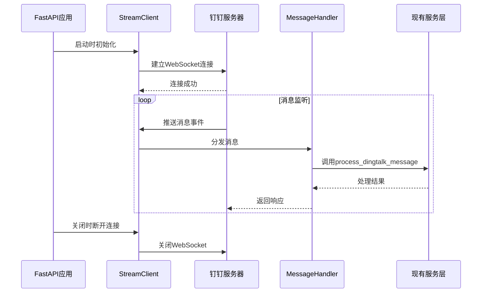

# 设计文档：钉钉Stream模式客户端

## 概述

实现钉钉Stream模式客户端，通过WebSocket主动连接钉钉服务器，监听并处理钉钉推送的消息。该方案解决了本地开发环境无公网IP的问题，使机器人能够在本地电脑上正常接收和响应用户消息。

## 主要算法/工作流



## 核心接口/类型

### 配置类型

```python
from pydantic_settings import BaseSettings

class Settings(BaseSettings):
    # 现有配置...
    
    # 钉钉Stream模式配置
    DINGTALK_CLIENT_ID: str = ""  # AppKey
    DINGTALK_CLIENT_SECRET: str = ""  # AppSecret
    DINGTALK_STREAM_ENABLED: bool = False  # 是否启用Stream模式
```

### Stream客户端接口

```python
from dingtalk_stream import AckMessage
from typing import Callable, Awaitable

class DingtalkStreamClient:
    """钉钉Stream模式客户端"""
    
    def __init__(
        self,
        client_id: str,
        client_secret: str,
        message_handler: Callable[[dict], Awaitable[AckMessage]]
    ):
        """初始化Stream客户端
        
        Args:
            client_id: 钉钉AppKey
            client_secret: 钉钉AppSecret
            message_handler: 消息处理回调函数
        """
        pass
    
    async def start(self) -> None:
        """启动客户端，建立WebSocket连接"""
        pass
    
    async def stop(self) -> None:
        """停止客户端，断开连接"""
        pass
    
    def is_running(self) -> bool:
        """检查客户端是否运行中"""
        pass
```

### 消息处理器接口

```python
class DingtalkMessageHandler:
    """钉钉消息处理器"""
    
    def __init__(self, db_session_factory):
        """初始化处理器
        
        Args:
            db_session_factory: 数据库会话工厂
        """
        pass
    
    async def handle_message(self, message: dict) -> AckMessage:
        """处理钉钉消息
        
        Args:
            message: 钉钉消息对象
            
        Returns:
            AckMessage: 响应消息
        """
        pass
```

## 关键函数与形式化规范

### 函数 1: start_stream_client()

```python
async def start_stream_client(
    client_id: str,
    client_secret: str,
    db_session_factory
) -> DingtalkStreamClient:
    """启动钉钉Stream客户端"""
```

**前置条件：**
- `client_id` 非空且有效
- `client_secret` 非空且有效
- `db_session_factory` 已正确配置

**后置条件：**
- 返回已启动的 `DingtalkStreamClient` 实例
- WebSocket连接已建立
- 消息监听已激活

**循环不变式：** N/A（无循环）

### 函数 2: handle_message()

```python
async def handle_message(message: dict) -> AckMessage:
    """处理钉钉推送的消息"""
```

**前置条件：**
- `message` 包含必需字段：`senderId`, `text`
- 数据库连接可用

**后置条件：**
- 返回 `AckMessage` 对象（状态码 200 表示成功）
- 如果消息有效，已调用 `process_dingtalk_message` 处理
- 无论成功或失败，都返回响应（避免钉钉重试）

**循环不变式：** N/A（无循环）

### 函数 3: process_dingtalk_message()

```python
async def process_dingtalk_message(
    user_id: int,
    dingtalk_user_id: str,
    message_content: str,
    db: AsyncSession
) -> None:
    """处理钉钉消息（复用现有逻辑）"""
```

**前置条件：**
- `user_id` 存在于数据库
- `dingtalk_user_id` 非空
- `message_content` 非空
- `db` 会话有效

**后置条件：**
- 消息已解析并处理
- 如果匹配到任务，任务状态已更新
- 响应消息已发送给用户

**循环不变式：**
- 在任务匹配循环中：所有已检查的任务都不满足匹配条件（直到找到匹配）

## 算法伪代码

### 主处理算法

```python
ALGORITHM start_dingtalk_stream_mode(app: FastAPI)
INPUT: app - FastAPI应用实例
OUTPUT: None（副作用：启动Stream客户端）

BEGIN
  ASSERT settings.DINGTALK_STREAM_ENABLED = true
  ASSERT settings.DINGTALK_CLIENT_ID ≠ ""
  ASSERT settings.DINGTALK_CLIENT_SECRET ≠ ""
  
  // 步骤 1: 创建数据库会话工厂
  db_factory ← create_async_session_factory()
  
  // 步骤 2: 创建消息处理器
  handler ← DingtalkMessageHandler(db_factory)
  
  // 步骤 3: 创建并启动Stream客户端
  client ← DingtalkStreamClient(
    client_id=settings.DINGTALK_CLIENT_ID,
    client_secret=settings.DINGTALK_CLIENT_SECRET,
    message_handler=handler.handle_message
  )
  
  AWAIT client.start()
  
  // 步骤 4: 保存客户端引用（用于关闭）
  app.state.dingtalk_stream_client ← client
  
  ASSERT client.is_running() = true
  
  LOG "钉钉Stream客户端已启动"
END
```

**前置条件：**
- Stream模式已启用
- 配置参数有效
- 数据库已初始化

**后置条件：**
- Stream客户端已启动并运行
- 客户端引用已保存到应用状态
- 日志已记录

**循环不变式：** N/A

### 消息处理算法

```python
ALGORITHM handle_dingtalk_message(message: dict)
INPUT: message - 钉钉消息对象
OUTPUT: ack_message - 响应消息

BEGIN
  // 步骤 1: 提取消息信息
  sender_id ← message.get("senderId")
  content ← message.get("text", {}).get("content", "")
  
  IF sender_id = null OR content = "" THEN
    RETURN AckMessage(status=200, message="success")
  END IF
  
  // 步骤 2: 查询用户映射
  async WITH db_session AS db DO
    settings ← QUERY UserNotificationSettings 
               WHERE dingtalk_user_id = sender_id
    
    IF settings = null THEN
      AWAIT send_bind_guide_message(sender_id)
      RETURN AckMessage(status=200, message="success")
    END IF
    
    user_id ← settings.user_id
    
    // 步骤 3: 检查频率限制
    is_allowed, rate_info ← check_rate_limit(user_id)
    
    IF NOT is_allowed THEN
      AWAIT send_rate_limit_message(sender_id, rate_info)
      RETURN AckMessage(status=200, message="success")
    END IF
    
    // 步骤 4: 异步处理消息（不阻塞响应）
    AWAIT run_in_background(
      process_dingtalk_message,
      user_id=user_id,
      dingtalk_user_id=sender_id,
      message_content=content,
      db=db
    )
  END WITH
  
  // 步骤 5: 立即返回成功响应
  RETURN AckMessage(status=200, message="success")
END
```

**前置条件：**
- message 参数已提供
- 数据库连接可用

**后置条件：**
- 返回 AckMessage 对象
- 消息已提交到后台处理队列
- 响应时间 < 200ms

**循环不变式：** N/A

### 生命周期管理算法

```python
ALGORITHM manage_stream_client_lifecycle(app: FastAPI)
INPUT: app - FastAPI应用实例
OUTPUT: None（副作用：管理客户端生命周期）

BEGIN
  // 启动阶段
  ON app.startup DO
    AWAIT init_db()
    
    IF settings.DINGTALK_STREAM_ENABLED THEN
      AWAIT start_dingtalk_stream_mode(app)
    END IF
  END ON
  
  // 运行阶段
  YIELD  // 应用运行
  
  // 关闭阶段
  ON app.shutdown DO
    IF app.state.dingtalk_stream_client EXISTS THEN
      client ← app.state.dingtalk_stream_client
      AWAIT client.stop()
      LOG "钉钉Stream客户端已停止"
    END IF
  END ON
END
```

**前置条件：**
- FastAPI应用已创建
- 配置已加载

**后置条件：**
- 启动时：如果启用，Stream客户端已启动
- 关闭时：Stream客户端已正确停止并清理资源

**循环不变式：** N/A

## 示例用法

### 示例 1: 配置启用Stream模式

```python
# .env 文件
DINGTALK_STREAM_ENABLED=true
DINGTALK_CLIENT_ID=your_app_key
DINGTALK_CLIENT_SECRET=your_app_secret
```

### 示例 2: 应用启动

```python
# backend/app/main.py
from contextlib import asynccontextmanager
from app.services.dingtalk_stream_client import start_dingtalk_stream_mode

@asynccontextmanager
async def lifespan(app: FastAPI):
    # 启动时初始化
    await init_db()
    
    # 启动钉钉Stream客户端
    if settings.DINGTALK_STREAM_ENABLED:
        await start_dingtalk_stream_mode(app)
    
    yield
    
    # 关闭时清理
    if hasattr(app.state, 'dingtalk_stream_client'):
        await app.state.dingtalk_stream_client.stop()

app = FastAPI(lifespan=lifespan)
```

### 示例 3: 消息处理

```python
# 用户在钉钉发送: "登录功能完成了80%"
# Stream客户端接收消息 → 调用handler.handle_message()
# handler提取信息并调用process_dingtalk_message()
# 系统解析进度 → 匹配任务 → 更新状态 → 发送确认消息
```

## 正确性属性

### 属性 1: 消息不丢失

```python
# 对于所有钉钉推送的消息 m
# 如果 Stream客户端正在运行
# 则 m 必定被 handle_message 处理
∀m ∈ Messages: client.is_running() ⟹ handled(m)
```

### 属性 2: 快速响应

```python
# 对于所有消息 m
# handle_message 的响应时间必须 < 200ms
∀m ∈ Messages: response_time(handle_message(m)) < 200ms
```

### 属性 3: 幂等性

```python
# 对于所有消息 m
# 多次处理同一消息不会产生副作用
∀m ∈ Messages: process(m) = process(process(m))
```

### 属性 4: 连接恢复

```python
# 如果连接断开
# 客户端会自动重连
∀t ∈ Time: connection_lost(t) ⟹ ∃t' > t: reconnected(t')
```

## 错误处理

### 错误场景 1: 配置缺失

**条件**: `DINGTALK_CLIENT_ID` 或 `DINGTALK_CLIENT_SECRET` 为空
**响应**: 记录警告日志，不启动Stream客户端，应用继续运行（降级到Webhook模式）
**恢复**: 用户配置后重启应用

### 错误场景 2: 连接失败

**条件**: 无法建立WebSocket连接（网络问题、认证失败等）
**响应**: 记录错误日志，dingtalk-stream SDK自动重试连接
**恢复**: SDK内置指数退避重试机制，最终恢复连接

### 错误场景 3: 消息处理异常

**条件**: `process_dingtalk_message` 抛出异常
**响应**: 捕获异常，记录错误日志，返回成功响应（避免钉钉重试）
**恢复**: 发送错误提示给用户，不影响后续消息处理

### 错误场景 4: 数据库连接失败

**条件**: 数据库不可用
**响应**: 捕获异常，记录错误，返回成功响应
**恢复**: 发送系统错误提示，等待数据库恢复

## 测试策略

### 单元测试方法

**测试目标**:
- `DingtalkStreamClient` 初始化和生命周期管理
- `DingtalkMessageHandler` 消息解析和分发
- 配置验证逻辑

**关键测试用例**:
1. 测试客户端启动和停止
2. 测试消息处理器正确提取消息字段
3. 测试配置缺失时的降级行为
4. 测试异常情况下的错误处理

**覆盖目标**: > 80%

### 集成测试方法

**测试目标**:
- Stream客户端与钉钉服务器的实际连接
- 端到端消息流（接收 → 处理 → 响应）
- 与现有服务层的集成

**关键测试用例**:
1. 测试真实环境下的消息接收和处理
2. 测试用户绑定流程
3. 测试任务更新流程
4. 测试频率限制

**测试环境**: 使用钉钉测试应用和测试群组

## 性能考虑

### 响应时间要求

- **目标**: 消息处理响应时间 < 200ms
- **策略**: 
  - 立即返回 `AckMessage`，不等待业务逻辑完成
  - 使用后台任务队列异步处理消息
  - 数据库查询使用索引优化

### 并发处理

- **场景**: 多个用户同时发送消息
- **策略**:
  - dingtalk-stream SDK内置并发处理
  - 使用异步I/O避免阻塞
  - 数据库连接池管理

### 资源占用

- **WebSocket连接**: 单个长连接，资源占用低
- **内存**: 消息处理使用流式处理，不缓存大量数据
- **CPU**: 异步I/O模型，CPU占用低

## 安全考虑

### 认证机制

- **客户端认证**: 使用 `client_id` 和 `client_secret` 向钉钉服务器认证
- **消息来源验证**: 钉钉服务器保证消息来源可信
- **用户身份验证**: 通过 `dingtalk_user_id` 映射到系统用户

### 数据安全

- **传输加密**: WebSocket使用TLS加密（wss://）
- **敏感信息**: `client_secret` 通过环境变量配置，不硬编码
- **日志脱敏**: 日志中不记录完整的 `client_secret`

### 频率限制

- **复用现有机制**: 使用 `dingtalk_rate_limiter` 防止滥用
- **限制策略**: 每用户每分钟最多10条消息

## 依赖项

### 外部依赖

- **dingtalk-stream**: 钉钉官方Stream SDK（版本 1.2.0）
- **httpx**: HTTP客户端（用于发送响应消息）
- **sqlalchemy**: 数据库ORM（查询用户映射）

### 内部依赖

- **app.services.dingtalk_service**: 消息发送服务
- **app.api.v1.dingtalk.process_dingtalk_message**: 消息处理逻辑（复用）
- **app.services.async_task_queue**: 后台任务队列
- **app.services.rate_limiter**: 频率限制
- **app.core.database**: 数据库会话管理

### 配置依赖

- **DINGTALK_CLIENT_ID**: 钉钉AppKey（必需）
- **DINGTALK_CLIENT_SECRET**: 钉钉AppSecret（必需）
- **DINGTALK_STREAM_ENABLED**: 启用开关（可选，默认false）
