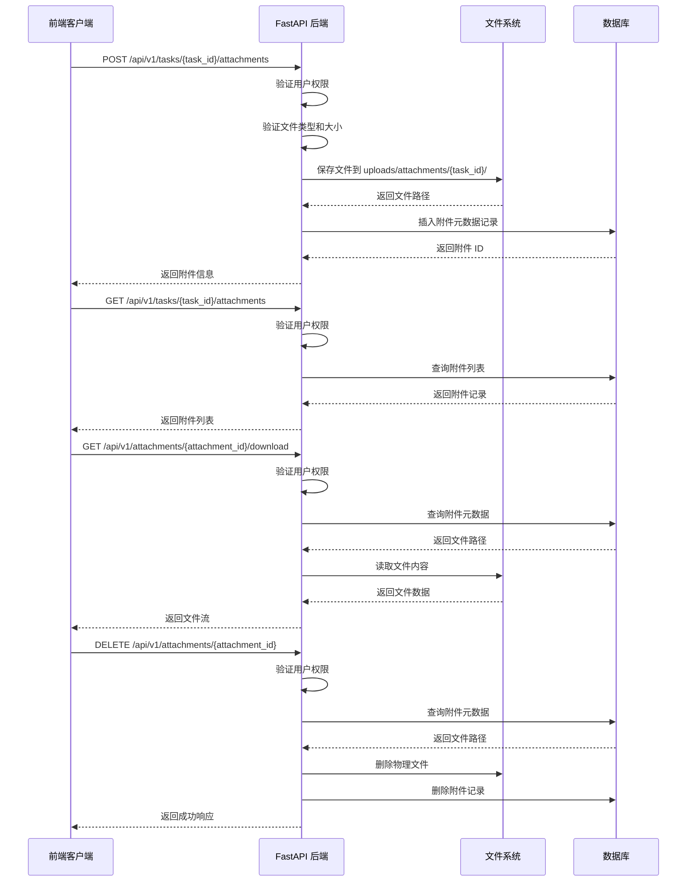

# Design Document: Task Attachments

## Overview

为任务管理系统添加附件上传和管理功能，支持多种文件格式（文档、图片、压缩包等），提供完整的上传、下载、删除操作，确保文件安全存储和权限控制。

## Main Algorithm/Workflow



## Core Interfaces/Types

```pascal
STRUCTURE AttachmentUploadRequest
  file: UploadFile
  task_id: Integer
END STRUCTURE

STRUCTURE AttachmentResponse
  id: Integer
  task_id: Integer
  user_id: Integer
  filename: String
  file_path: String
  file_size: Integer
  mime_type: String
  created_at: DateTime
END STRUCTURE

STRUCTURE AttachmentListResponse
  attachments: Array<AttachmentResponse>
  total: Integer
END STRUCTURE

STRUCTURE FileValidationResult
  VARIANT Valid
  VARIANT InvalidType(message: String)
  VARIANT TooLarge(message: String)
END STRUCTURE
```

## Key Functions with Formal Specifications

### Function 1: upload_attachment()

```pascal
FUNCTION upload_attachment(task_id, file, current_user)
  INPUT: task_id (Integer), file (UploadFile), current_user (User)
  OUTPUT: AttachmentResponse
```

**Preconditions:**
- task_id 对应的任务存在
- current_user 对任务所属项目有访问权限
- file 不为空

**Postconditions:**
- 文件已保存到文件系统
- 数据库中已创建附件记录
- 返回的 AttachmentResponse 包含完整的附件信息
- 文件路径格式为 `uploads/attachments/{task_id}/{timestamp}_{uuid}_{filename}`

**Loop Invariants:** N/A

### Function 2: validate_file()

```pascal
FUNCTION validate_file(file)
  INPUT: file (UploadFile)
  OUTPUT: FileValidationResult
```

**Preconditions:**
- file 对象已初始化

**Postconditions:**
- 返回 Valid 当且仅当文件类型在允许列表中且大小 ≤ 50MB
- 返回 InvalidType 当文件扩展名不在允许列表中
- 返回 TooLarge 当文件大小超过 50MB
- 不修改 file 对象

**Loop Invariants:** N/A

### Function 3: get_attachments()

```pascal
FUNCTION get_attachments(task_id, current_user)
  INPUT: task_id (Integer), current_user (User)
  OUTPUT: AttachmentListResponse
```

**Preconditions:**
- task_id 对应的任务存在
- current_user 对任务所属项目有访问权限

**Postconditions:**
- 返回该任务的所有附件列表
- 附件按创建时间降序排列
- total 字段等于附件数量

**Loop Invariants:** N/A

### Function 4: download_attachment()

```pascal
FUNCTION download_attachment(attachment_id, current_user)
  INPUT: attachment_id (Integer), current_user (User)
  OUTPUT: FileResponse
```

**Preconditions:**
- attachment_id 对应的附件存在
- current_user 对附件所属任务的项目有访问权限
- 物理文件存在于文件系统中

**Postconditions:**
- 返回文件流供客户端下载
- Content-Disposition header 设置为 attachment
- 不修改文件内容

**Loop Invariants:** N/A

### Function 5: delete_attachment()

```pascal
FUNCTION delete_attachment(attachment_id, current_user)
  INPUT: attachment_id (Integer), current_user (User)
  OUTPUT: MessageResponse
```

**Preconditions:**
- attachment_id 对应的附件存在
- current_user 对附件所属任务的项目有访问权限

**Postconditions:**
- 物理文件已从文件系统删除
- 数据库中的附件记录已删除
- 返回成功消息

**Loop Invariants:** N/A

## Algorithmic Pseudocode

### Main Upload Algorithm

```pascal
ALGORITHM upload_attachment(task_id, file, current_user)
INPUT: task_id of type Integer, file of type UploadFile, current_user of type User
OUTPUT: attachment of type AttachmentResponse

BEGIN
  // Step 1: Verify task access permission
  task ← get_task_with_access(task_id, current_user)
  ASSERT task IS NOT NULL
  
  // Step 2: Validate file
  validation_result ← validate_file(file)
  IF validation_result IS InvalidType OR validation_result IS TooLarge THEN
    RAISE HTTPException(400, validation_result.message)
  END IF
  
  // Step 3: Generate unique filename
  timestamp ← current_timestamp()
  unique_id ← generate_uuid()
  safe_filename ← sanitize_filename(file.filename)
  new_filename ← concat(timestamp, "_", unique_id, "_", safe_filename)
  
  // Step 4: Create directory if not exists
  upload_dir ← concat("backend/uploads/attachments/", task_id)
  IF NOT directory_exists(upload_dir) THEN
    create_directory(upload_dir)
  END IF
  
  // Step 5: Save file to filesystem
  file_path ← concat(upload_dir, "/", new_filename)
  save_file(file, file_path)
  
  // Step 6: Create database record
  attachment ← TaskAttachment(
    task_id: task_id,
    user_id: current_user.id,
    filename: file.filename,
    file_path: file_path,
    file_size: file.size,
    mime_type: file.content_type
  )
  database.add(attachment)
  database.commit()
  
  ASSERT attachment.id IS NOT NULL
  
  RETURN AttachmentResponse(attachment)
END
```

**Preconditions:**
- task_id 对应的任务存在且用户有权限
- file 是有效的上传文件对象
- 文件系统有足够的存储空间

**Postconditions:**
- 文件已安全保存到指定目录
- 数据库记录已创建并提交
- 返回完整的附件信息

**Loop Invariants:** N/A

### File Validation Algorithm

```pascal
ALGORITHM validate_file(file)
INPUT: file of type UploadFile
OUTPUT: result of type FileValidationResult

BEGIN
  // Define allowed extensions
  ALLOWED_EXTENSIONS ← [
    "doc", "docx", "pdf", "txt", "md",
    "jpg", "jpeg", "png", "gif",
    "zip", "rar",
    "xls", "xlsx", "ppt", "pptx"
  ]
  
  MAX_FILE_SIZE ← 50 * 1024 * 1024  // 50MB in bytes
  
  // Step 1: Extract file extension
  filename ← file.filename
  extension ← get_file_extension(filename).lower()
  
  // Step 2: Check file type
  IF extension NOT IN ALLOWED_EXTENSIONS THEN
    RETURN InvalidType("不支持的文件类型: " + extension)
  END IF
  
  // Step 3: Check file size
  IF file.size > MAX_FILE_SIZE THEN
    RETURN TooLarge("文件大小超过限制（最大 50MB）")
  END IF
  
  RETURN Valid
END
```

**Preconditions:**
- file 对象包含 filename 和 size 属性

**Postconditions:**
- 返回验证结果，不修改输入
- 文件类型检查不区分大小写

**Loop Invariants:** N/A

### Download Algorithm

```pascal
ALGORITHM download_attachment(attachment_id, current_user)
INPUT: attachment_id of type Integer, current_user of type User
OUTPUT: file_response of type FileResponse

BEGIN
  // Step 1: Query attachment metadata
  attachment ← database.query(TaskAttachment).filter(id = attachment_id).first()
  
  IF attachment IS NULL THEN
    RAISE HTTPException(404, "附件不存在")
  END IF
  
  // Step 2: Verify access permission
  task ← get_task_with_access(attachment.task_id, current_user)
  ASSERT task IS NOT NULL
  
  // Step 3: Check file exists
  IF NOT file_exists(attachment.file_path) THEN
    RAISE HTTPException(404, "文件不存在")
  END IF
  
  // Step 4: Return file response
  RETURN FileResponse(
    path: attachment.file_path,
    filename: attachment.filename,
    media_type: attachment.mime_type,
    headers: {
      "Content-Disposition": concat("attachment; filename=", quote(attachment.filename))
    }
  )
END
```

**Preconditions:**
- attachment_id 是有效的整数
- current_user 已通过身份验证

**Postconditions:**
- 返回文件响应对象供下载
- 文件名已正确编码以支持中文
- 不修改文件内容

**Loop Invariants:** N/A

### Delete Algorithm

```pascal
ALGORITHM delete_attachment(attachment_id, current_user)
INPUT: attachment_id of type Integer, current_user of type User
OUTPUT: message of type MessageResponse

BEGIN
  // Step 1: Query attachment metadata
  attachment ← database.query(TaskAttachment).filter(id = attachment_id).first()
  
  IF attachment IS NULL THEN
    RAISE HTTPException(404, "附件不存在")
  END IF
  
  // Step 2: Verify access permission
  task ← get_task_with_access(attachment.task_id, current_user)
  ASSERT task IS NOT NULL
  
  // Step 3: Delete physical file
  IF file_exists(attachment.file_path) THEN
    delete_file(attachment.file_path)
  END IF
  
  // Step 4: Delete database record
  database.delete(attachment)
  database.commit()
  
  RETURN MessageResponse(message: "附件删除成功")
END
```

**Preconditions:**
- attachment_id 对应的附件存在
- current_user 有删除权限

**Postconditions:**
- 物理文件已删除（如果存在）
- 数据库记录已删除
- 事务已提交

**Loop Invariants:** N/A

## Example Usage

```pascal
// Example 1: Upload attachment
SEQUENCE
  file ← User_Upload("document.pdf")
  task_id ← 123
  current_user ← get_authenticated_user()
  
  attachment ← upload_attachment(task_id, file, current_user)
  
  DISPLAY "附件上传成功: " + attachment.filename
  DISPLAY "文件大小: " + format_bytes(attachment.file_size)
END SEQUENCE

// Example 2: Get attachments list
SEQUENCE
  task_id ← 123
  current_user ← get_authenticated_user()
  
  result ← get_attachments(task_id, current_user)
  
  FOR each attachment IN result.attachments DO
    DISPLAY attachment.filename + " (" + format_bytes(attachment.file_size) + ")"
  END FOR
END SEQUENCE

// Example 3: Download attachment
SEQUENCE
  attachment_id ← 456
  current_user ← get_authenticated_user()
  
  file_response ← download_attachment(attachment_id, current_user)
  
  SAVE file_response TO local_filesystem
  DISPLAY "文件下载成功"
END SEQUENCE

// Example 4: Delete attachment
SEQUENCE
  attachment_id ← 456
  current_user ← get_authenticated_user()
  
  result ← delete_attachment(attachment_id, current_user)
  
  DISPLAY result.message
END SEQUENCE

// Example 5: Error handling - Invalid file type
SEQUENCE
  file ← User_Upload("malicious.exe")
  task_id ← 123
  current_user ← get_authenticated_user()
  
  TRY
    attachment ← upload_attachment(task_id, file, current_user)
  CATCH HTTPException AS e
    DISPLAY "上传失败: " + e.detail
  END TRY
END SEQUENCE
```

## Correctness Properties

*A property is a characteristic or behavior that should hold true across all valid executions of a system-essentially, a formal statement about what the system should do. Properties serve as the bridge between human-readable specifications and machine-verifiable correctness guarantees.*

### Property 1: Access Control Consistency

*For any* attachment operation (upload, query, download, delete) and any user, the operation should succeed only if the user has access permission to the task's project.

**Validates: Requirements 1.1, 2.1, 3.2, 4.2**

### Property 2: File Type Validation

*For any* file with an extension in the Allowed_Extensions list, the File_Validator should accept it; for any file with an extension not in the list, the File_Validator should reject it with an appropriate error message.

**Validates: Requirements 1.2, 1.3, 7.1, 7.2, 7.3, 7.4, 7.5, 8.2**

### Property 3: File Size Validation

*For any* file with size not exceeding Max_File_Size (50MB), the File_Validator should accept it; for any file exceeding this limit, the File_Validator should reject it with an appropriate error message.

**Validates: Requirements 1.4, 1.5, 8.3**

### Property 4: Filename Generation Completeness

*For any* valid file upload, the generated filename should contain three components: a timestamp, a UUID, and the sanitized original filename.

**Validates: Requirements 1.6, 5.1, 5.2, 5.3**

### Property 5: Upload Round-Trip Preservation

*For any* valid file content and filename, uploading the file and then downloading it should return the exact same content and original filename without modification.

**Validates: Requirements 1.8, 1.10, 3.5, 3.8**

### Property 6: Metadata Completeness

*For any* successfully uploaded attachment, the database record should contain all required metadata fields (task_id, user_id, filename, file_path, file_size, mime_type) with correct values, and the response should include all these fields.

**Validates: Requirements 1.9, 1.10, 2.5**

### Property 7: Query Completeness and Ordering

*For any* task with N attachments, querying the attachment list should return exactly N attachments sorted by creation time in descending order, with the total count equal to N.

**Validates: Requirements 2.2, 2.3, 2.4**

### Property 8: Download Header Correctness

*For any* attachment download, the response should include a Content-Disposition header set to "attachment" with properly encoded filename, and the correct MIME type should be set in the response headers.

**Validates: Requirements 3.6, 3.7**

### Property 9: File Path Uniqueness

*For any* two different attachments, their file_path values should be unique, ensuring no file overwrites occur.

**Validates: Requirements 5.4, 5.5**

### Property 10: Delete Completeness

*For any* attachment deletion operation that succeeds, both the physical file and the database record should be removed, and subsequent queries should confirm neither exists.

**Validates: Requirements 4.3, 4.4, 4.6**

### Property 11: Referential Integrity

*For any* attachment record in the database, the referenced task_id should correspond to an existing task in the Task table.

**Validates: Requirements 6.1**

### Property 12: Error Response Consistency

*For any* operation that fails due to missing permissions, the system should return a 403 error; for invalid input (wrong file type or size), a 400 error; for non-existent resources, a 404 error.

**Validates: Requirements 8.1, 8.2, 8.3, 8.4, 8.5**

### Property 13: Attachment Existence Validation

*For any* download or delete operation, the system should first verify the attachment exists in the database, returning a 404 error if it does not.

**Validates: Requirements 3.1, 4.1, 8.4**

### Property 14: Physical File Existence Check

*For any* download operation, if the attachment record exists but the physical file is missing, the system should return a 404 error with message "文件不存在".

**Validates: Requirements 3.3, 3.4, 8.5**

### Property 15: Directory Creation Idempotence

*For any* task_id, creating the upload directory structure should succeed whether the directory already exists or not, ensuring the directory is available for file storage.

**Validates: Requirements 1.7**
