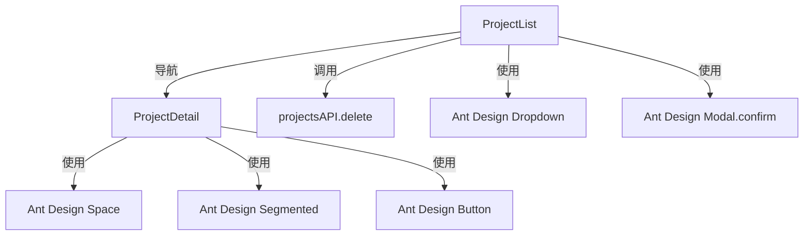

# 设计文档 - 项目管理UI改进

## 概述

本设计文档描述了项目管理界面的UI改进方案，包括项目列表页的删除功能优化和项目详情页的工具栏重构。设计遵循Ant Design设计规范，确保用户体验的一致性和响应式布局的适配性。

### 设计目标

1. **提升操作效率**: 在项目列表页提供快捷删除入口，减少操作步骤
2. **优化信息架构**: 重构项目详情页工具栏，按功能分组提升可发现性
3. **保持一致性**: 使用统一的设计语言和交互模式
4. **响应式适配**: 确保在不同设备上都有良好的使用体验

### 设计范围

- **包含**: ProjectList.tsx 和 ProjectDetail.tsx 的UI改进
- **不包含**: 后端API修改、新功能开发、数据模型变更

## 架构

### 高层架构

本次改进属于前端展示层的优化，不涉及架构层面的变更。改进遵循现有的组件化架构：

```
┌─────────────────────────────────────────┐
│         用户界面层 (UI Layer)            │
├─────────────────────────────────────────┤
│  ProjectList.tsx  │  ProjectDetail.tsx  │
│  - 项目卡片        │  - 工具栏重构       │
│  - 下拉菜单        │  - 功能分组         │
│  - 删除确认        │  - 响应式布局       │
└─────────────────────────────────────────┘
           ↓                    ↓
┌─────────────────────────────────────────┐
│         API 层 (API Layer)              │
│  projectsAPI.delete()                   │
│  projectsAPI.list()                     │
│  tasksAPI.getTree()                     │
└─────────────────────────────────────────┘
```

### 组件关系



## 组件和接口

### 1. ProjectList 组件改进

#### 组件职责
- 展示项目列表卡片
- 提供项目操作下拉菜单
- 处理删除确认和API调用

#### 接口定义

```typescript
// 下拉菜单项配置
interface MenuItemConfig {
  key: string;
  label: string;
  icon: React.ReactNode;
  danger?: boolean;
  onClick: () => void;
}

// 项目卡片 Props
interface ProjectCardProps {
  project: Project;
  onNavigate: (id: number) => void;
  onDelete: (id: number) => void;
}
```

#### 关键方法

```typescript
// 获取菜单项配置
const getMenuItems = (project: Project): MenuItemConfig[] => [
  {
    key: 'enter',
    label: '进入项目',
    icon: <FolderOpenOutlined />,
    onClick: () => navigate(`/project/${project.id}`)
  },
  {
    key: 'delete',
    label: '删除',
    icon: <DeleteOutlined />,
    danger: true,
    onClick: () => handleDelete(project.id)
  }
];

// 删除处理函数
const handleDelete = async (id: number) => {
  Modal.confirm({
    title: '确认删除',
    content: '删除后无法恢复，确定要删除该项目吗？',
    okText: '确认',
    cancelText: '取消',
    okType: 'danger',
    onOk: async () => {
      try {
        const res = await projectsAPI.delete(id);
        if (res.code === 200) {
          message.success('删除成功');
          fetchProjects();
        } else {
          message.error(res.message || '删除失败');
        }
      } catch (error: any) {
        message.error(error.message || '删除失败');
      }
    }
  });
};
```

### 2. ProjectDetail 工具栏重构

#### 组件职责
- 按功能分组展示操作按钮
- 提供清晰的视觉层次
- 响应式布局适配

#### 工具栏结构

```typescript
interface ToolbarSection {
  id: string;
  title: string;
  items: ToolbarItem[];
}

interface ToolbarItem {
  key: string;
  label: string;
  icon?: React.ReactNode;
  type?: 'primary' | 'default';
  onClick: () => void;
}

// 工具栏配置
const toolbarSections: ToolbarSection[] = [
  {
    id: 'core-actions',
    title: '核心操作',
    items: [
      { key: 'add', label: '添加任务', icon: <PlusOutlined />, type: 'primary' },
      { key: 'ai-create', label: 'AI智能创建', icon: <RobotOutlined /> },
      { key: 'ai-analyze', label: 'AI分析', icon: <RobotOutlined /> }
    ]
  },
  {
    id: 'view-switch',
    title: '视图切换',
    items: [] // 使用 Segmented 组件
  },
  {
    id: 'tools',
    title: '工具',
    items: [
      { key: 'tags', label: '标签管理', icon: <TagOutlined /> },
      { key: 'export', label: '导出', icon: <ExportOutlined /> },
      { key: 'import', label: '导入', icon: <ImportOutlined /> }
    ]
  }
];
```

#### 布局组件

```typescript
// 工具栏容器组件
const ToolbarContainer: React.FC<{ children: React.ReactNode }> = ({ children }) => (
  <div className="mb-4 space-y-4 md:space-y-0 md:flex md:justify-between md:items-center">
    {children}
  </div>
);

// 功能分组组件
const FunctionGroup: React.FC<{
  title?: string;
  children: React.ReactNode;
  className?: string;
}> = ({ title, children, className }) => (
  <div className={`flex flex-col gap-2 ${className || ''}`}>
    {title && <span className="text-xs text-gray-500 font-medium">{title}</span>}
    <Space wrap>{children}</Space>
  </div>
);
```

## 数据模型

本次改进不涉及数据模型变更，使用现有的数据结构：

```typescript
// 项目数据模型（现有）
interface Project {
  id: number;
  name: string;
  description?: string;
  start_date?: string;
  end_date?: string;
  task_count: number;
  completed_count: number;
  status: string;
}

// 任务数据模型（现有）
interface Task {
  id: number;
  name: string;
  description?: string;
  status: string;
  priority: string;
  progress: number;
  parent_id?: number;
  children?: Task[];
}
```

## 错误处理

### 错误场景和处理策略

#### 1. API 调用失败

```typescript
try {
  const res = await projectsAPI.delete(id);
  if (res.code === 200) {
    message.success('删除成功');
    fetchProjects();
  } else {
    message.error(res.message || '删除失败');
  }
} catch (error: any) {
  // 网络错误或其他异常
  if (error.message.includes('timeout')) {
    message.error('请求超时，请稍后重试');
  } else if (error.message.includes('Network')) {
    message.error('网络连接失败，请检查网络');
  } else {
    message.error(error.message || '操作失败');
  }
}
```

#### 2. 权限不足

```typescript
// 在删除前检查权限（如果后端返回权限信息）
const handleDelete = async (id: number) => {
  // 假设项目对象包含权限信息
  if (!project.canDelete) {
    message.error('权限不足，无法删除该项目');
    return;
  }
  
  Modal.confirm({
    // ... 确认对话框配置
  });
};
```

#### 3. 用户取消操作

```typescript
Modal.confirm({
  title: '确认删除',
  content: '删除后无法恢复，确定要删除该项目吗？',
  onOk: async () => {
    // 执行删除
  },
  onCancel: () => {
    // 用户取消，不需要额外处理
    // Modal 会自动关闭
  }
});
```

## 测试策略

### 单元测试

#### ProjectList 组件测试

```typescript
describe('ProjectList', () => {
  it('should render dropdown menu with correct items', () => {
    // 测试下拉菜单渲染
  });

  it('should show confirm dialog when delete is clicked', () => {
    // 测试删除确认对话框
  });

  it('should call API and refresh list on delete confirm', async () => {
    // 测试删除API调用和列表刷新
  });

  it('should show error message when delete fails', async () => {
    // 测试删除失败的错误提示
  });

  it('should navigate to project detail when enter is clicked', () => {
    // 测试进入项目导航
  });
});
```

#### ProjectDetail 工具栏测试

```typescript
describe('ProjectDetail Toolbar', () => {
  it('should render all function groups', () => {
    // 测试所有功能分组渲染
  });

  it('should render buttons in correct groups', () => {
    // 测试按钮分组正确性
  });

  it('should call correct handlers when buttons are clicked', () => {
    // 测试按钮点击事件
  });

  it('should adapt layout on mobile devices', () => {
    // 测试响应式布局
  });
});
```

### 集成测试

```typescript
describe('ProjectList Integration', () => {
  it('should complete full delete workflow', async () => {
    // 1. 渲染项目列表
    // 2. 点击下拉菜单
    // 3. 点击删除
    // 4. 确认删除
    // 5. 验证API调用
    // 6. 验证列表刷新
  });
});

describe('ProjectDetail Integration', () => {
  it('should switch between different views', async () => {
    // 测试视图切换功能
  });

  it('should open modals from toolbar buttons', async () => {
    // 测试工具栏按钮打开对应的模态框
  });
});
```

### 端到端测试

```typescript
describe('UI Improvements E2E', () => {
  it('should delete project from list page', () => {
    // 1. 登录
    // 2. 进入项目列表
    // 3. 点击项目卡片的下拉菜单
    // 4. 点击删除
    // 5. 确认删除
    // 6. 验证项目已从列表中移除
  });

  it('should use toolbar functions in detail page', () => {
    // 1. 进入项目详情页
    // 2. 测试各个工具栏按钮
    // 3. 验证功能正常工作
  });
});
```

### 视觉回归测试

```typescript
describe('Visual Regression', () => {
  it('should match ProjectList snapshot', () => {
    // 截图对比测试
  });

  it('should match ProjectDetail toolbar snapshot', () => {
    // 截图对比测试
  });

  it('should match mobile layout snapshot', () => {
    // 移动端布局截图对比
  });
});
```

### 性能测试

```typescript
describe('Performance', () => {
  it('should render dropdown menu within 100ms', () => {
    // 测试下拉菜单渲染性能
  });

  it('should complete delete operation within 500ms', () => {
    // 测试删除操作性能
  });

  it('should switch views within 200ms', () => {
    // 测试视图切换性能
  });
});
```

### 可访问性测试

```typescript
describe('Accessibility', () => {
  it('should have proper ARIA labels', () => {
    // 测试 ARIA 标签
  });

  it('should be keyboard navigable', () => {
    // 测试键盘导航
  });

  it('should have sufficient color contrast', () => {
    // 测试颜色对比度
  });
});
```

## 实现细节

### ProjectList 实现

#### 1. 下拉菜单实现

```tsx
// 在 ProjectList.tsx 中修改 Card 的 extra 属性
<Card
  key={project.id}
  hoverable
  extra={
    <Dropdown 
      menu={{ items: getMenuItems(project) }} 
      trigger={['click']}
      onClick={(e) => e.stopPropagation()} // 防止触发卡片点击
    >
      <Button 
        type="text" 
        icon={<MoreOutlined />}
        onClick={(e) => e.stopPropagation()} // 防止触发卡片点击
      />
    </Dropdown>
  }
  onClick={() => navigate(`/project/${project.id}`)}
>
  {/* 卡片内容 */}
</Card>
```

#### 2. 菜单项配置

```tsx
const getMenuItems = (project: any) => [
  {
    key: 'enter',
    label: '进入项目',
    icon: <FolderOpenOutlined />,
    onClick: () => navigate(`/project/${project.id}`)
  },
  {
    type: 'divider' as const
  },
  {
    key: 'delete',
    label: '删除',
    icon: <DeleteOutlined />,
    danger: true,
    onClick: () => handleDelete(project.id)
  }
];
```

### ProjectDetail 工具栏实现

#### 1. 响应式布局结构

```tsx
<div className="mb-4">
  {/* 移动端：垂直堆叠 */}
  <div className="flex flex-col gap-4 md:hidden">
    <FunctionGroup title="核心操作">
      <Button type="primary" icon={<PlusOutlined />} onClick={() => handleAddTask()}>
        添加任务
      </Button>
      <Button 
        type="primary" 
        style={{ background: '#722ed1', borderColor: '#722ed1' }} 
        onClick={() => setAiModalVisible(true)}
      >
        ✨ AI智能创建
      </Button>
      <Button
        type="primary"
        icon={<RobotOutlined />}
        style={{ background: '#52c41a', borderColor: '#52c41a' }}
        onClick={() => {
          setAiMode('analyze');
          setAiPanelOpen(true);
        }}
      >
        AI分析
      </Button>
    </FunctionGroup>

    <FunctionGroup title="视图切换">
      <Segmented
        options={viewOptions}
        value={viewType}
        onChange={(v) => setViewType(v as string)}
        block
      />
    </FunctionGroup>

    <FunctionGroup title="工具">
      <Button icon={<TagOutlined />} onClick={() => setTagManagerOpen(true)}>
        标签管理
      </Button>
      <Button icon={<ExportOutlined />} onClick={() => setExportOpen(true)}>
        导出
      </Button>
      <Button icon={<ImportOutlined />} onClick={() => setImportOpen(true)}>
        导入
      </Button>
    </FunctionGroup>
  </div>

  {/* 桌面端：水平布局 */}
  <div className="hidden md:flex md:justify-between md:items-center">
    <Space size="large">
      {/* 核心操作区 */}
      <Space>
        <Button type="primary" icon={<PlusOutlined />} onClick={() => handleAddTask()}>
          添加任务
        </Button>
        <Button 
          type="primary" 
          style={{ background: '#722ed1', borderColor: '#722ed1' }} 
          onClick={() => setAiModalVisible(true)}
        >
          ✨ AI智能创建
        </Button>
        <Button
          type="primary"
          icon={<RobotOutlined />}
          style={{ background: '#52c41a', borderColor: '#52c41a' }}
          onClick={() => {
            setAiMode('analyze');
            setAiPanelOpen(true);
          }}
        >
          AI分析
        </Button>
      </Space>

      {/* 视图切换区 */}
      <Segmented
        options={viewOptions}
        value={viewType}
        onChange={(v) => setViewType(v as string)}
      />
    </Space>

    {/* 工具区 */}
    <Space>
      <Button icon={<TagOutlined />} onClick={() => setTagManagerOpen(true)}>
        标签管理
      </Button>
      <Button icon={<ExportOutlined />} onClick={() => setExportOpen(true)}>
        导出
      </Button>
      <Button icon={<ImportOutlined />} onClick={() => setImportOpen(true)}>
        导入
      </Button>
    </Space>
  </div>
</div>
```

#### 2. 视觉分隔

使用 Tailwind CSS 类名实现视觉分隔：

```tsx
// 使用 gap 和 size 属性
<Space size="large"> {/* 大间距分隔功能组 */}
  <Space> {/* 核心操作区 */}
    {/* 按钮 */}
  </Space>
  
  <Segmented /> {/* 视图切换区 */}
</Space>

<Space> {/* 工具区 */}
  {/* 按钮 */}
</Space>
```

#### 3. 性能优化

```tsx
// 使用 React.memo 优化按钮组件
const ToolbarButton = React.memo<{
  icon?: React.ReactNode;
  label: string;
  onClick: () => void;
  type?: 'primary' | 'default';
  style?: React.CSSProperties;
}>(({ icon, label, onClick, type, style }) => (
  <Button 
    type={type} 
    icon={icon} 
    onClick={onClick}
    style={style}
  >
    {label}
  </Button>
));

// 使用 useMemo 缓存视图选项
const viewOptions = useMemo(() => [
  { value: 'tree', icon: <ApartmentOutlined />, label: '树形' },
  { value: 'kanban', icon: <AppstoreOutlined />, label: '看板' },
  { value: 'list', icon: <UnorderedListOutlined />, label: '列表' },
  { value: 'gantt', icon: <BarChartOutlined />, label: '甘特图' },
  { value: 'dependency', icon: <ApartmentOutlined />, label: '依赖图' }
], []);
```

### 样式实现

#### Tailwind CSS 类名

```css
/* 响应式布局 */
.flex-col          /* 移动端垂直布局 */
.md:flex           /* 桌面端水平布局 */
.md:justify-between /* 桌面端两端对齐 */
.md:items-center   /* 桌面端垂直居中 */

/* 间距 */
.gap-4             /* 移动端间距 */
.space-y-4         /* 移动端垂直间距 */
.md:space-y-0      /* 桌面端取消垂直间距 */

/* 隐藏/显示 */
.md:hidden         /* 桌面端隐藏 */
.hidden.md:flex    /* 移动端隐藏，桌面端显示 */
```

#### Ant Design 样式定制

```tsx
// 按钮样式
<Button 
  type="primary" 
  style={{ 
    background: '#722ed1',  // 紫色主题
    borderColor: '#722ed1' 
  }}
>
  ✨ AI智能创建
</Button>

<Button
  type="primary"
  icon={<RobotOutlined />}
  style={{ 
    background: '#52c41a',  // 绿色主题
    borderColor: '#52c41a' 
  }}
>
  AI分析
</Button>
```

## 迁移和部署

### 迁移步骤

1. **代码修改**
   - 修改 `ProjectList.tsx` 的卡片 extra 属性
   - 重构 `ProjectDetail.tsx` 的工具栏布局
   - 添加响应式样式类名

2. **测试验证**
   - 运行单元测试
   - 执行集成测试
   - 进行手动测试

3. **代码审查**
   - 检查代码质量
   - 验证设计一致性
   - 确认无破坏性变更

4. **部署**
   - 构建生产版本
   - 部署到测试环境
   - 验证功能正常
   - 部署到生产环境

### 回滚计划

如果部署后发现问题：

1. **立即回滚**: 恢复到上一个稳定版本
2. **问题分析**: 分析失败原因
3. **修复问题**: 在开发环境修复
4. **重新测试**: 完整测试流程
5. **再次部署**: 部署修复版本

### 兼容性

- **浏览器兼容性**: Chrome 90+, Firefox 88+, Safari 14+, Edge 90+
- **设备兼容性**: 桌面端、平板、手机
- **屏幕尺寸**: 320px - 1920px+

## 附录

### A. Ant Design 组件参考

#### Dropdown 组件

```tsx
<Dropdown 
  menu={{ items: menuItems }}  // 菜单项配置
  trigger={['click']}          // 触发方式
  placement="bottomRight"      // 弹出位置
>
  <Button />
</Dropdown>
```

#### Modal.confirm 方法

```tsx
Modal.confirm({
  title: '确认删除',           // 标题
  content: '删除后无法恢复',    // 内容
  okText: '确认',              // 确认按钮文本
  cancelText: '取消',          // 取消按钮文本
  okType: 'danger',            // 确认按钮类型
  onOk: async () => {},        // 确认回调
  onCancel: () => {}           // 取消回调
});
```

#### Segmented 组件

```tsx
<Segmented
  options={[
    { value: 'tree', icon: <Icon />, label: '树形' }
  ]}
  value={currentValue}
  onChange={(value) => setValue(value)}
  block  // 移动端占满宽度
/>
```

### B. 响应式断点

Tailwind CSS 默认断点：

- `sm`: 640px
- `md`: 768px
- `lg`: 1024px
- `xl`: 1280px
- `2xl`: 1536px

本设计使用 `md` (768px) 作为主要断点。

### C. 图标使用

```tsx
import {
  PlusOutlined,
  DeleteOutlined,
  EditOutlined,
  MoreOutlined,
  FolderOpenOutlined,
  RobotOutlined,
  TagOutlined,
  ExportOutlined,
  ImportOutlined,
  ApartmentOutlined,
  AppstoreOutlined,
  UnorderedListOutlined,
  BarChartOutlined
} from '@ant-design/icons';
```

### D. 颜色规范

```typescript
// 主题色
const colors = {
  primary: '#1890ff',      // 蓝色 - 主要操作
  success: '#52c41a',      // 绿色 - 成功/AI分析
  warning: '#faad14',      // 橙色 - 警告
  danger: '#ff4d4f',       // 红色 - 危险操作
  purple: '#722ed1',       // 紫色 - AI创建
  gray: '#8c8c8c'          // 灰色 - 次要信息
};
```
