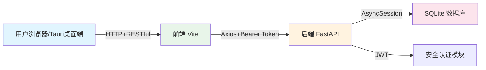
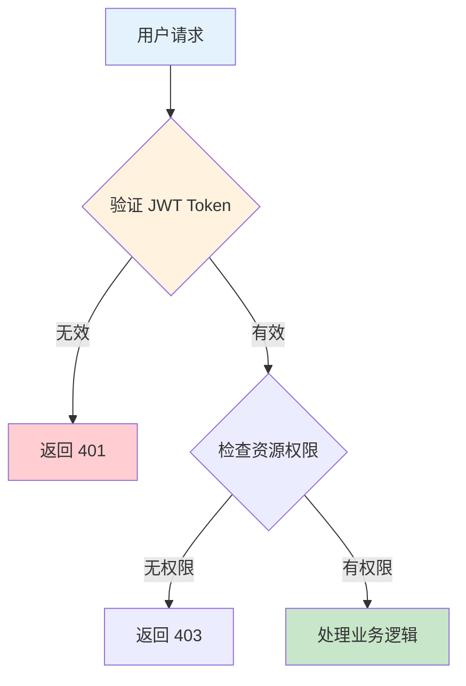
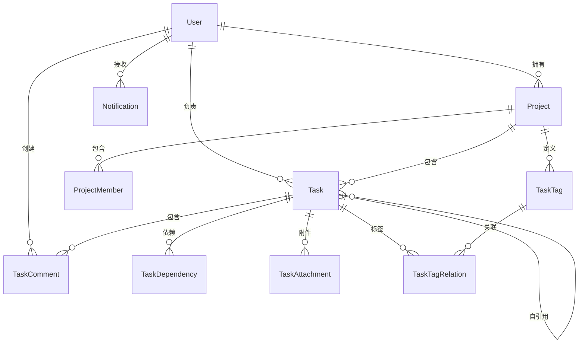
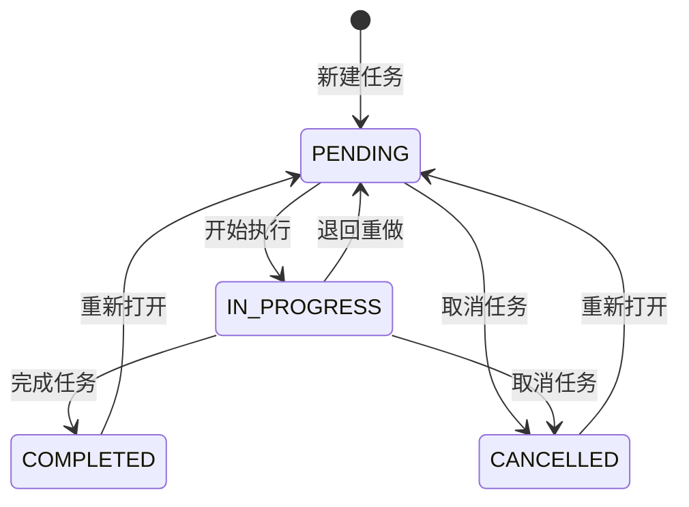
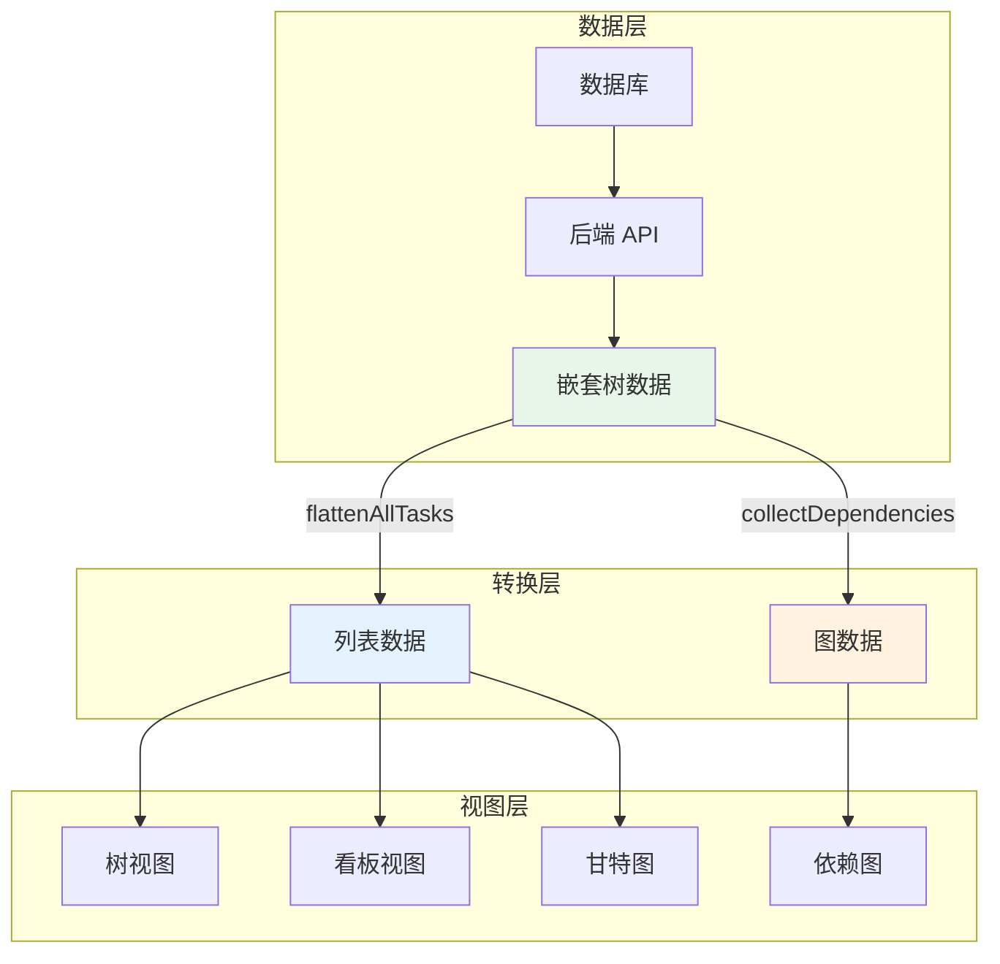
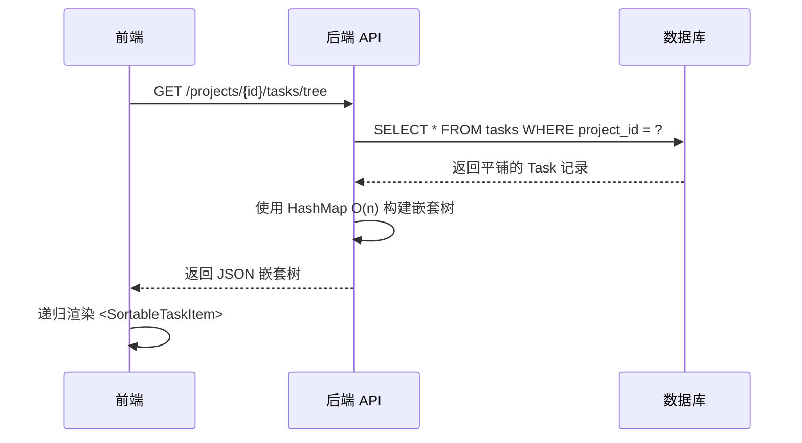

# TaskTree 系统架构说明文档

> [!info] 概述
> 本文档全面梳理 TaskTree 项目的整体架构、技术栈、核心模块设计以及数据流向。

---

## 1. 系统总体架构

TaskTree 采用了经典的**前后端分离架构**，致力于为用户提供一个跨平台、高性能、直观可视化的项目与任务管理系统。

### 1.1 技术栈总览

| 分层 | 核心技术 | 说明 |
| :--- | :--- | :--- |
| **前端 (Client)** | React 18, TypeScript, Vite | 构建用户界面的核心框架，使用 Vite 提供极速的本地开发热更新。 |
| **UI 与交互** | Ant Design 5, Tailwind CSS | AntD 提供标准化的组件基础，Tailwind 用于快速编写原子化辅助样式。 |
| **复杂视图生态** | `@dnd-kit`, `reactflow`, `gantt-task-react` | 支撑无限层级拖拽、依赖梳理网状图和时间线调度的核心图形库。 |
| **状态管理** | Zustand | 轻量级状态管理，主要负责全局的用户认证态及部分需要跨同级组件共享的数据。 |
| **后端 (Server)** | Python 3.11, FastAPI | 高性能、基于标准的现代 Python Web 框架，自带交互式 API 文档。 |
| **数据持久化** | SQLAlchemy 2.0 (ORM), SQLite(异步) | 采用 2.0 风格的声明式 ORM 进行对象映射，通过 `aiosqlite` 提供全异步的数据库访问。 |
| **安全认证** | JWT, passlib(bcrypt) | 无状态的 JSON Web Token 标准校验访问权限，密码使用 bcrypt 单向哈希。 |

### 1.2 高层数据流向



> [!tip] 数据流特点
> - 前端统一通过 `src/api/index.ts` 封装 Axios 实例
> - 所有请求携带 Bearer Token
> - 后端使用 Pydantic Schemas 进行数据过滤和序列化

---

## 2. 后端架构设计 (Backend)

后端代码位于 `backend/app` 目录下，遵循典型的 MVC/三层架构模式演变而来的领域模块化结构：

### 2.1 目录结构

```
backend/app/
├── api/
│   └── v1/            # 路由层：按业务拆分为 auth.py, tasks.py, projects.py 等
├── core/              # 核心基座层：配置 config.py, 数据库配置 database.py, 安全鉴权 security.py
├── models/            # 数据库模型层：SQLAlchemy 表定义 mapped classes
├── schemas/           # 数据传输模型层：Pydantic models，负责校验入参和格式化出参
└── main.py            # 应用程序入口，组合所有路由并挂载 CORS 等中间件
```

### 2.2 核心机制说明

> [!warning] 关键设计
> - **数据库引擎延迟加载**：在 `database.py` 中，使用了全局单例模式的 `create_async_engine` 和 `async_sessionmaker`。
> - **状态流转与权限控制**：每个需要操作实体的路由，都必须调用 `get_task_with_access()` 函数。
> - **关联表设计 (Models)**：使用 `DeclarativeBase` 定义了 10 张核心表，Task 模型使用自引用 (`parent_id`) 构建任务树结构。

#### 2.2.1 数据库访问模式

```python
# database.py 核心模式
from app.core.database import get_db

@router.get("/tasks")
async def get_tasks(current_user: User = Depends(get_current_user), 
                    db: AsyncSession = Depends(get_db)):
    # 自动利用 try...except...rollback 保障事务安全
    result = await db.execute(select(Task))
    return result.scalars().all()
```

#### 2.2.2 权限验证流程



---

## 3. 数据库模型 (10张核心表)

### 3.1 ER 关系总览



### 3.2 核心模型说明

| 模型 | 说明 | 关键字段 |
| :--- | :--- | :--- |
| **User** | 系统用户 | email, password_hash, nickname, avatar |
| **Project** | 项目（顶层容器） | name, description, owner_id, status |
| **ProjectMember** | 项目成员多对多关系 | project_id, user_id, role |
| **Task** | 任务（支持无限层级树） | parent_id (自引用), status, priority |
| **TaskDependency** | 任务依赖关系 | task_id → dependent_task_id |
| **TaskTag** | 项目级标签 | project_id, name, color |
| **TaskTagRelation** | 任务-标签多对多 | task_id, tag_id (复合主键) |
| **TaskComment** | 任务评论 | task_id, user_id, content |
| **TaskAttachment** | 任务附件 | task_id, filename, file_path |
| **Notification** | 用户通知 | user_id, type, is_read |

> [!example] Task 自引用设计
> Task 模型通过 `parent_id` 外键自引用，实现无限层级的树形结构：
> ```python
> parent = relationship('Task', remote_side=[id], backref='children')
> ```

---

## 4. 状态流转规则

### 4.1 任务状态流转矩阵



### 4.2 状态常量定义

| 状态值 | 中文标签 | 说明 |
| :--- | :--- | :--- |
| `pending` | 待办 | 任务初始状态 |
| `in_progress` | 进行中 | 正在处理中 |
| `completed` | 已完成 | 任务已完成 |
| `cancelled` | 已取消 | 任务已取消 |

> [!tip] 优先级
> - 高 (high)
> - 中 (medium)  
> - 低 (low)

---

## 5. 前端架构设计 (Frontend)

前端代码位于 `frontend/src`，架构重点在于极复杂界面的切割与状态同步。

### 5.1 目录结构

```
frontend/src/
├── api/               # 对 Axios 的二次封装及所有后端端点的调用的中心化文件
├── components/        # 公用的独立可复用 UI 与视图组装区块
│   ├── view/          # 高阶可视化视图（Gantt）
│   ├── dependency/    # 依赖连线拓扑图（ReactFlow）
│   ├── task/          # 任务详情浮层等业务组件
│   └── export/        # 功能类弹窗
├── constants/         # 前端相关的静态配置（与后端对齐）
├── pages/             # 路由顶层页面：路由的实际挂载点
├── stores/            # Zustand：存放身份认证 authToken 和用户信息
├── types/             # 全局的 TS Interface 声明
└── App.tsx            # 基于 react-router-dom 的页面骨架与路由导航
```

### 5.2 界面视图解耦策略

> [!success] 数据流设计
> 任务树项目最大的前端挑战在于数据的**多种形态表现**：

1. **单一数据源**：`ProjectDetail.tsx` 是数据的总管家
2. **扁平化能力映射**：通过纯函数 (`flattenAllTasks`, `collectDependencies`) 生成展平形态
3. **独立渲染器模式**：
   - 树形视图 (Tree/dnd-kit)：组件递归渲染
   - 甘特图 (gantt-task-react)：时间条展示
   - 依赖图 (ReactFlow)：Node/Edge 布局



---

## 6. 关键业务流程解析

### 6.1 无限层级任务树加载与渲染



> [!example] 性能优化
> 后端使用 HashMap 在内存中极速拼装父子级，提前根据 Sort_Order 排序，保证 O(n) 复杂度。

### 6.2 任务状态与通知联动

1. 用户在前端切换任务状态为「已完成」
2. 调用 `PUT /tasks/{id}`
3. 后端执行：
   - 校验状态流转合法性 (`constants.py` 转移矩阵)
   - 调用 `create_notification` 注入站内通知
   - 随同本次更新事务一并 Commit

---

## 7. 项目未来迭代留口

> [!abstract] 架构冗余设计
> - **Schema 分离**：严格区分 `TaskCreate`, `TaskUpdate`, `TaskDetailResponse`
> - **统一鉴权入口**：`get_current_user` 依赖，未来可零成本接入 OAuth
> - **独立附件与日志模块**：`TaskAttachment` 与 `OperationLog` 实体表已准备就绪

---

## 附录 A：API 端点概览

| 模块 | 前缀 | 主要端点 |
| :--- | :--- | :--- |
| 认证 | `/api/v1/tasktree/auth` | login, register, logout |
| 用户 | `/api/v1/tasktree/users` | profile, update |
| 项目 | `/api/v1/tasktree/projects` | CRUD, members, export |
| 任务 | `/api/v1/tasktree` | CRUD, move, batch, dependencies, tags, comments |
| 通知 | `/api/v1/tasktree/notifications` | list, read, delete |

---

## 附录 B：架构可视化

- [[TaskTree-架构图.canvas]] - 交互式架构图（可在 Obsidian 中打开）

---

> [!note]
> 文档更新时间: 2026-04-12