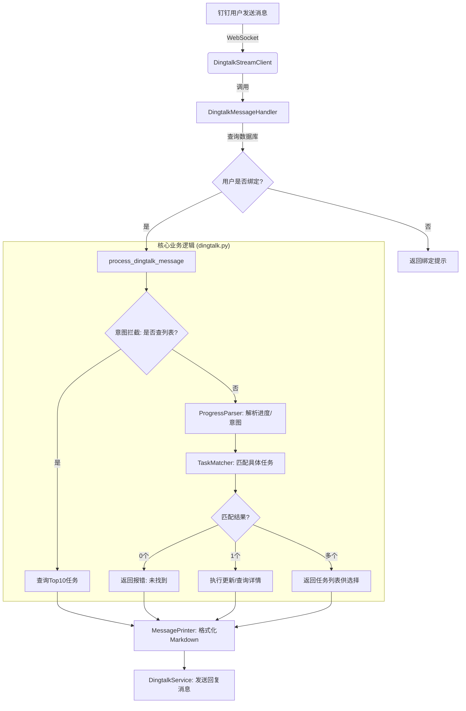

# 钉钉智能助手消息处理流程白皮书

> [!info] 说明
> 本文档详细描述了 TaskTree 钉钉智能助手（Stream 模式）从接收消息到返回结果的全链路处理流程，供开发人员参考和维护。

## 1. 架构全景图

---

## 2. 详细步骤说明

### 步骤 1：入口 - 监听消息 (`Stream 模式`)
*   **核心文件**: `backend/app/services/dingtalk_stream_client.py`
*   **逻辑说明**: 
    *   系统启动时通过 WebSocket 与钉钉服务器建立长连接。
    *   `raw_process` 方法捕获推送的原始 JSON。
    *   提取关键字段：`senderId` (用户加密ID) 和 `content` (文本消息)。

### 步骤 2：身份识别与权限校验
*   **核心文件**: `backend/app/services/dingtalk_stream_client.py` -> `handle_message`
*   **逻辑说明**: 
    *   根据 `senderId` 查询数据库中的 `UserNotificationSettings`。
    *   获取对应的系统 `user_id`。
    *   **频率限制**: 调用 `dingtalk_rate_limiter` 检查该用户是否发送过于频繁。

### 步骤 3：意图拦截（快捷逻辑）
*   **核心文件**: `backend/app/api/v1/dingtalk.py` -> `process_dingtalk_message`
*   **逻辑说明**: 
    *   **拦截词**: "我的任务", "任务列表", "我有哪些任务", "查任务", "任务有哪些"。
    *   **动作**: 匹配成功则直接从数据库读取该用户优先级最高的 10 条进行中/待处理任务，生成 Markdown 列表回复，终止后续解析。

### 步骤 4：语义与进度解析 (`ProgressParser`)
*   **核心文件**: `backend/app/services/progress_parser_service.py`
*   **逻辑说明**: 
    *   使用规则引擎识别用户动作（完成、进行中、延期、反馈问题）。
    *   如果未识别出动作，默认为 `query` (查询) 意图。
    *   提取百分比（如 "50%"）、天数（如 "3天"）等数值。

### 步骤 5：任务匹配引擎 (`TaskMatcher`)
*   **核心文件**: `backend/app/services/task_matcher.py`
*   **逻辑说明**: 
    *   **打分机制**:
        1.  **完全匹配** (100分): 消息等于任务名。
        2.  **包含匹配** (80分): 任务名包含消息中的词。
        3.  **反向包含匹配** (70分): 消息长句中包含任务名（解决自然语言提问）。
        4.  **状态加分** (+20分): 匹配结果中，“进行中”的任务得分更高。
    *   **输出**: 返回得分最高的一组或一个任务。

### 步骤 6：消息格式化 (`MessagePrinter`)
*   **核心文件**: `backend/app/services/message_printer.py`
*   **逻辑说明**: 
    *   将任务对象转换为 Markdown 字符串。
    *   使用特殊字符绘制进度条（如 `[▓▓▓░░]`）。
    *   根据任务状态添加 Emoji 图标（✅, ⌛, 📅）。

### 步骤 7：API 回复发送
*   **核心文件**: `backend/app/services/dingtalk_service.py`
*   **逻辑说明**: 
    *   获取机器人 Access Token（带 Redis 级缓存）。
    *   调用钉钉 OpenAPI 接口将 Markdown 推送回用户。

---

## 3. 开发维护指南

| 修改需求 | 对应文件 | 对应函数/位置 |
| :--- | :--- | :--- |
| **增加新指令** (如：统计) | `dingtalk.py` | `is_list_intent` 附近的条件判断 |
| **修改回复样式** (如：换配色) | `message_printer.py` | `format_task_list` 或 `format_task_detail` |
| **优化匹配准确率** | `task_matcher.py` | `_calculate_match_score` |
| **处理新消息类型** (如：图片) | `dingtalk_stream_client.py` | `raw_process` 里的内容提取逻辑 |
| **调整 AI 解析逻辑** | `progress_parser_service.py` | `_parse_with_rules` |

> [!tip] 开发者提示
> 修改 Python 文件后需重启 Docker 容器使更改生效：`docker compose up -d --build backend`

## 4. 注意事项

> [!warning] 重要提醒
> 1. **Docker 重启**: 在本地修改以上 Python 文件后，由于生产环境（Gunicorn）运行在 Docker 容器中，需执行 `docker compose up -d --build backend` 才能生效。
> 2. **异步处理**: 消息处理是在独立线程中完成的，以确保 WebSocket 连接不会因为 AI 处理耗时而超时断开。
