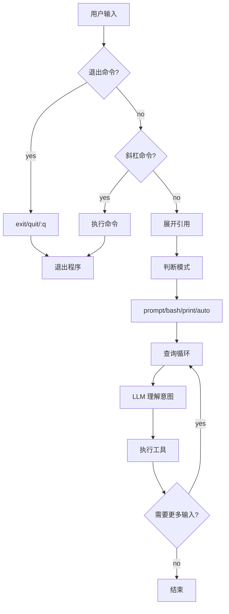

# Claude Code 意图理解与执行系统设计

> 基于 claude-source-leaked-main 源码分析
> 更新时间: 2026-04-29

---

## 一、输入处理（handlePromptSubmit）

### 核心设计思路

```
1. 入口统一（handlePromptSubmit）
2. 输入模式区分（prompt/bash/print/auto）
3. 斜杠命令优先解析
4. 模式切换决定处理流程
```

### 1.1 入口handlePromptSubmit

**源码位置**：`src/utils/handlePromptSubmit.ts:120`

```typescript
export async function handlePromptSubmit(
  params: HandlePromptSubmitParams,
): Promise<void> {
  // 队列命令：直接执行
  if (queuedCommands?.length) {
    await executeUserInput({ queuedCommands, ... })
    return
  }

  // 普通输入处理
  const input = params.input ?? ''
  const mode = params.mode ?? 'prompt'

  // 展开引用 [Image #N] -> 实际内容
  const finalInput = expandPastedTextRefs(input, pastedContents)

  // 斜杠命令解析
  if (finalInput.trim().startsWith('/')) {
    const commandName = ...
    const commandArgs = ...
  }

  // 执行查询
  await onQuery(...)
}
```

### 1.2 输入模式

**源码位置**：`src/types/textInputTypes.ts`

```typescript
type PromptInputMode =
  | 'prompt'   // 正常对话
  | 'bash'     // Bash 命令模式
  | 'print'    // 打印模式
  | 'auto'     // 自动模式
```

| 模式 | 含义 | 处理方式 |
|:-----|:-----|:--------|
| `prompt` | 正常对话 | 标准查询流程 |
| `bash` | Bash 命令 | 直接执行 |
| `print` | 打印模式 | 输出结果 |
| `auto` | 自动模式 | AI 自主决策 |

### 1.3 斜杠命令解析

**源码位置**：`src/utils/handlePromptSubmit.ts:229`

```typescript
// 斜杠命令解析
if (finalInput.trim().startsWith('/')) {
  const trimmedInput = finalInput.trim()
  const spaceIndex = trimmedInput.indexOf(' ')
  const commandName = spaceIndex === -1
    ? trimmedInput.slice(1)
    : trimmedInput.slice(1, spaceIndex)
  const commandArgs = spaceIndex === -1
    ? ''
    : trimmedInput.slice(spaceIndex + 1).trim()
}
```

### 1.4 引用展开

**源码位置**：`src/history.js`

```typescript
// 展开 [Image #N] 引用为实际内容
const finalInput = expandPastedTextRefs(input, pastedContents)
const referencedIds = new Set(parseReferences(input).map(r => r.id))
```

### 1.5 退出命令处理

```typescript
// 支持 exit/quit/:q/:q!/:wq/:wq!
if (['exit', 'quit', ':q', ':q!', ':wq', ':wq!'].includes(input.trim())) {
  exit()
}
```

---

## 二、输入预处理（processUserInput）

### 核心设计思路

```
1. processUserInput 入口统一
2. 模式+上下文决定处理
3. 附件处理
```

### 2.1 入口 processUserInput

**源码位置**：`src/utils/processUserInput/processUserInput.ts:85`

```typescript
export async function processUserInput({
  input,
  mode,
  setToolJSX,
  context,
  pastedContents,
  ideSelection,
  messages,
  skipSlashCommands,
  ...
}: ProcessUserInputParams): Promise<ProcessUserInputBaseResult> {
  // 显示用户输入
  if (mode === 'prompt' && inputString !== null && !isMeta) {
    setUserInputOnProcessing?.(inputString)
  }

  // 核心处理
  const result = await processUserInputBase(
    input,
    mode,
    setToolJSX,
    context,
    pastedContents,
    ideSelection,
    messages,
    ...
  )

  return result
}
```

### 2.2 processUserInputBase

**源码位置**：`src/utils/processUserInput/processUserInput.ts:281`

```typescript
async function processUserInputBase(
  input: string | Array<ContentBlockParam>,
  mode: PromptInputMode,
  ...
): Promise<ProcessUserInputBaseResult> {
  // 1. 解析输入为 Message
  const inputMessage = parseInput(input, mode)

  // 2. 处理斜杠命令
  if (!skipSlashCommands && isSlashCommand(inputMessage)) {
    return handleSlashCommand(inputMessage)
  }

  // 3. 处理附件
  if (pastedContents) {
    return handleAttachments(pastedContents)
  }

  // 4. 处理 IDE 选中
  if (ideSelection) {
    return handleIdeSelection(ideSelection)
  }

  // 5. 构建 UserMessage
  return buildUserMessage(inputMessage)
}
```

### 2.3 附件处理

```typescript
// 处理粘贴的图片/文本
const MAX_HOOK_OUTPUT_LENGTH = 10000

function applyTruncation(content: string): string {
  if (content.length > MAX_HOOK_OUTPUT_LENGTH) {
    return `${content.substring(0, MAX_HOOK_OUTPUT_LENGTH)}… [truncated]`
  }
  return content
}
```

### 2.4 IDE 选中处理

```typescript
// 处理 IDE 选中的内容
if (ideSelection) {
  // 将选中区域作为上下文添加
  return {
    ...result,
    context: ideSelection.content,
    selectionRange: ideSelection.range,
  }
}
```

---

## 三、查询循环（query.ts）

### 核心设计思路

```
1. query -> queryLoop 双层结构
2. while(true) 无限循环直到结束
3. tool_use 处理 + 上下文压缩
```

### 3.1 入口 query

**源码位置**：`src/query.ts:219`

```typescript
export async function* query(
  params: QueryParams,
): AsyncGenerator<StreamEvent | Message | TombstoneMessage> {
  const consumedCommandUuids: string[] = []
  const terminal = yield* queryLoop(params, consumedCommandUuids)
  return terminal
}
```

### 3.2 核心循环 queryLoop

**源码位置**：`src/query.ts:241`

```typescript
async function* queryLoop(
  params: QueryParams,
  consumedCommandUuids: string[],
): AsyncGenerator<StreamEvent | Message> {
  while (true) {
    // 1. 构建消息
    let messagesForQuery = [...getMessagesAfterCompactBoundary(messages)]

    // 2. 上下文压缩（microcompact）
    messagesForQuery = await deps.microcompact(messagesForQuery, ...)

    // 3. 调用 API
    const response = await deps.claude({
      messages: messagesForQuery,
      systemPrompt,
      ...
    })

    // 4. 处理响应
    if (response.type === 'content_block_delta') {
      yield response  // 流式输出
    }

    if (response.type === 'tool_use') {
      // 执行工具
      const toolResult = await executeTool(response.tool, toolUseContext)
      messages.push(toolResult)
      continue  // 继续循环
    }

    // 5. 正常结束
    yield response
    break
  }
}
```

### 3.3 上下文压缩

**源码位置**：`src/query.ts:414`

```typescript
// microcompact: 单轮压缩工具结果
const microcompactResult = await deps.microcompact(
  messagesForQuery,
  toolUseContext,
  querySource,
)
messagesForQuery = microcompactResult.messages

// HISTORY_SNIP: 历史裁剪
if (feature('HISTORY_SNIP')) {
  const snipResult = snipModule!.snipCompactIfNeeded(messagesForQuery)
  messagesForQuery = snipResult.messages
}
```

---

## 四、System Prompt 构建

### 核心设计思路

```
1. 5层优先级构建（buildEffectiveSystemPrompt）
2. 分段缓存机制（systemPromptSection）
3. 动态边界标记（__SYSTEM_PROMPT_DYNAMIC_BOUNDARY__）
```

### 4.1 5层优先级系统

**源码位置**：`src/utils/systemPrompt.ts:41`

```typescript
export function buildEffectiveSystemPrompt({
  mainThreadAgentDefinition,
  customSystemPrompt,
  defaultSystemPrompt,
  appendSystemPrompt,
  overrideSystemPrompt,
}): SystemPrompt {
  // Priority 0: Override (loop mode, testing) - 替换所有其他 prompt
  if (overrideSystemPrompt) {
    return asSystemPrompt([overrideSystemPrompt])
  }

  // Priority 1: Coordinator (多 worker 编排模式)
  if (feature('COORDINATOR_MODE') && isEnvTruthy(process.env.CLAUDE_CODE_COORDINATOR_MODE)) {
    return asSystemPrompt([getCoordinatorSystemPrompt(), ...append])
  }

  // Priority 2: Agent (子代理定义)
  const agentSystemPrompt = mainThreadAgentDefinition?.getSystemPrompt(...)

  // Proactive 模式下: agent 指令追加到 default
  // 非 Proactive 模式: agent 指令替换 default
  if (agentSystemPrompt && (feature('PROACTIVE') || feature('KAIROS')) {
    return asSystemPrompt([...defaultSystemPrompt, customAgentInstructions, ...])
  }

  // Priority 3: Custom (--system-prompt flag) → Priority 4: Default
  return asSystemPrompt([...(agentSystemPrompt ?? customSystemPrompt ?? defaultSystemPrompt), ...])
}
```

| 优先级 | 来源 | 说明 |
|:-------|:-----|:-----|
| Priority 0 | Override | loop mode、testing，替换所有其他 prompt |
| Priority 1 | Coordinator | 多 worker 编排模式 |
| Priority 2 | Agent | 子代理定义 |
| Priority 3 | Custom | --system-prompt flag |
| Priority 4 | Default | 标准 Claude Code prompt |
| + | appendSystemPrompt | 始终追加（除非 override） |

### 4.2 默认 System Prompt 的 9大板块

**源码位置**：`src/constants/prompts.ts:444`

```typescript
export async function getSystemPrompt(...): Promise<string[]> {
  return [
    // === 静态内容（可缓存）===
    getSimpleIntroSection(outputStyleConfig),        // 1. Identity
    getSimpleSystemSection(),                         // 2. System Rules
    getSimpleDoingTasksSection(),                    // 3. Task Execution (最详细)
    getActionsSection(),                              // 4. Careful Actions
    getUsingYourToolsSection(enabledTools),         // 5. Tool Usage
    getSimpleToneAndStyleSection(),                 // 6. Tone
    getOutputEfficiencySection(),                   // 7. Output Efficiency
    // === BOUNDARY MARKER ===
    SYSTEM_PROMPT_DYNAMIC_BOUNDARY,                  // 8. 缓存边界
    // === 动态内容（每turn重新计算）===
    ...resolvedDynamicSections,                      // 9. 动态部分
  ]
}
```

| 板块 | 内容 | 说明 |
|:-----|:-----|:-----|
| 1 | Identity | "You are an interactive agent..." |
| 2 | System Rules | 工具执行、权限模式、注入检测 |
| 3 | Task Execution | 最详细：读代码再修改、不添加未请求的功能 |
| 4 | Careful Actions | 破坏性操作需确认 |
| 5 | Tool Usage | 使用专用工具（Read/Edit/Glob/Grep） |
| 6 | Tone | 无emoji、简洁、file:line 格式 |
| 7 | Output Efficiency | 一句话能说清就不说三句 |
| 8 | Cache Boundary | `__SYSTEM_PROMPT_DYNAMIC_BOUNDARY__` |
| 9 | Environment | CWD、平台、模型、知识截止 |

### 4.3 分段结构 systemPromptSection

**源码位置**：`src/constants/systemPromptSections.ts`

```typescript
type SystemPromptSection = {
  name: string
  compute: () => string | null | Promise<string | null>
  cacheBreak: boolean  // 是否打破缓存
}

// 创建缓存的 section（默认，缓存直到 /clear 或 /compact）
export function systemPromptSection(
  name: string,
  compute: ComputeFn,
): SystemPromptSection {
  return { name, compute, cacheBreak: false }
}

// 创建易失性 section（每轮重新计算）
export function DANGEROUS_uncachedSystemPromptSection(
  name: string,
  compute: ComputeFn,
  reason: string,
): SystemPromptSection {
  return { name, compute, cacheBreak: true }
}
```

### 4.4 动态分段定义

**源码位置**：`src/constants/prompts.ts:491`

```typescript
const dynamicSections = [
  systemPromptSection('session_guidance', () =>
    getSessionSpecificGuidanceSection(enabledTools, skillToolCommands)),
  systemPromptSection('memory', () => loadMemoryPrompt()),
  systemPromptSection('ant_model_override', () => getAntModelOverrideSection()),
  systemPromptSection('env_info_simple', () => computeSimpleEnvInfo(model, dirs)),
  systemPromptSection('language', () => getLanguageSection(settings.language)),
  systemPromptSection('output_style', () => getOutputStyleSection(config)),
  // 易失性：MCP 服务器每轮可能连接/断开
  DANGEROUS_uncachedSystemPromptSection('mcp_instructions', () =>
    getMcpInstructionsSection(mcpClients),
  'MCP servers connect/disconnect between turns'),
  systemPromptSection('scratchpad', () => getScratchpadInstructions()),
  // ...
]
```

### 4.5 缓存机制

**源码位置**：`src/constants/systemPromptSections.ts:43`

```typescript
export async function resolveSystemPromptSections(
  sections: SystemPromptSection[],
): Promise<(string | null)[]> {
  const cache = getSystemPromptSectionCache()

  return Promise.all(
    sections.map(async s => {
      if (!s.cacheBreak && cache.has(s.name)) {
        return cache.get(s.name) ?? null  // 命中缓存
      }
      const value = await s.compute()      // 计算
      setSystemPromptSectionCacheEntry(s.name, value)  // 缓存
      return value
    }),
  )
}

// 清除缓存（/clear 和 /compact 时调用）
export function clearSystemPromptSections(): void {
  clearSystemPromptSectionState()
  clearBetaHeaderLatches()
}
```

### 4.6 缓存边界标记

**源码位置**：`src/constants/prompts.ts:114`

```typescript
// 边界标记：静态/动态内容的分界线
export const SYSTEM_PROMPT_DYNAMIC_BOUNDARY =
  '__SYSTEM_PROMPT_DYNAMIC_BOUNDARY__'
```

| 区域 | 内容 | 缓存策略 |
|:-----|:-----|:---------|
| Before boundary | 静态内容，可全局缓存 | scope: 'global' |
| After boundary | 动态内容（memory、MCP、语言），每轮计算 | 不可缓存 |

### 4.7 模型知识截止

**源码位置**：`src/constants/prompts.ts:713`

```typescript
function getKnowledgeCutoff(modelId: string): string | null {
  if (modelId.includes('claude-sonnet-4-6')) return 'August 2025'
  if (modelId.includes('claude-opus-4-6')) return 'May 2025'
  if (modelId.includes('claude-haiku-4')) return 'February 2025'
  return null
}
```

| 模型 | 知识截止 |
|:-----|:---------|
| Claude Opus 4.6 | May 2025 |
| Claude Sonnet 4.6 | August 2025 |
| Claude Haiku 4.5 | February 2025 |

---

## 五、工具执行

### 核心设计思路

```
1. 查找工具 → 输入验证 → 权限检查 → 执行 → 结果处理
2. PreToolUse hooks → 权限决策 → PostToolUse hooks
3. 4级权限分类
```

### 5.1 工具查找

**源码位置**：`src/services/tools/toolExecution.ts:337`

```typescript
export async function* runToolUse(
  toolUse: ToolUseBlock,
  canUseTool: CanUseToolFn,
  toolUseContext: ToolUseContext,
): AsyncGenerator<MessageUpdateLazy, void> {
  // 先在可用工具中查找
  let tool = findToolByName(toolUseContext.options.tools, toolName)

  // 找不到则检查是否是废弃的别名
  if (!tool) {
    const fallbackTool = findToolByName(getAllBaseTools(), toolName)
    if (fallbackTool && fallbackTool.aliases?.includes(toolName)) {
      tool = fallbackTool
    }
  }

  // 工具不存在
  if (!tool) {
    yield createUserMessage({ content: `<tool_use_error>No such tool: ${toolName}</tool_use_error>` })
    return
  }
  // ...
}
```

### 5.2 输入验证（两层验证）

**源码位置**：`src/services/tools/toolExecution.ts:614`

```typescript
// 第一层：Zod schema 类型验证
const parsedInput = tool.inputSchema.safeParse(input)
if (!parsedInput.success) {
  return { error: formatZodValidationError(tool.name, parsedInput.error) }
}

// 第二层：工具特定的验证逻辑
const isValidCall = await tool.validateInput?.(parsedInput.data, toolUseContext)
if (isValidCall?.result === false) {
  return { error: isValidCall.message }
}
```

### 5.3 权限控制流程

**源码位置**：`src/services/tools/toolExecution.ts:599`

```typescript
async function checkPermissionsAndCallTool(
  tool: Tool,
  toolUseID: string,
  input: { ... },
  toolUseContext: ToolUseContext,
  canUseTool: CanUseToolFn,
  ...
): Promise<MessageUpdateLazy[]> {
  // 1. PreToolUse Hooks（可修改输入、阻止执行）
  for await (const result of runPreToolUseHooks(...)) {
    switch (result.type) {
      case 'hookUpdatedInput':
        processedInput = result.updatedInput  // Hook 修改输入
        break
      case 'hookPermissionResult':
        hookPermissionResult = result.hookPermissionResult
        break
      case 'stop':
        return createToolResultStopMessage(...)  // Hook 阻止执行
    }
  }

  // 2. 权限决策（allow/deny/ask）
  const resolved = await resolveHookPermissionDecision(
    hookPermissionResult,
    tool,
    processedInput,
    toolUseContext,
    canUseTool,
    ...
  )

  // 3. 权限被拒绝
  if (permissionDecision.behavior !== 'allow') {
    return createToolResultErrorMessage(permissionDecision.message)
  }

  // 4. 执行工具
  const result = await tool.call(callInput, toolUseContext, ...)

  // 5. PostToolUse Hooks
  for await (const hookResult of runPostToolUseHooks(...)) { ... }

  return result
}
```

### 5.4 权限模式（4级）

**源码位置**：`src/types/permissions.ts:16`

```typescript
// 用户可见的权限模式
const EXTERNAL_PERMISSION_MODES = [
  'acceptEdits',    // 接受所有编辑
  'bypassPermissions', // 完全信任
  'default',      // 每次询问
  'dontAsk',      // 自动拒绝
  'plan',         // 只读模式
] as const

// 内部模式（增加了 auto, bubble）
type InternalPermissionMode = ExternalPermissionMode | 'auto' | 'bubble'
```

| 模式 | 说明 | 权限级别 |
|:-----|:-----|:---------|
| `default` | 每次询问 | 需要确认 |
| `plan` | 只读模式 | 阻止写操作 |
| `dontAsk` | 自动拒绝 | 不允许任何操作 |
| `acceptEdits` | 编辑时跳过确认 | 自动允许 |
| `bypassPermissions` | 完全信任 | 完全允许 |
| `auto` | AI 智能判断 | 自动分级 |

### 5.5 权限行为

**源码位置**：`src/types/permissions.ts:44`

```typescript
type PermissionBehavior = 'allow' | 'deny' | 'ask'
```

| 行为 | 说明 |
|:-----|:-----|
| `allow` | 允许执行 |
| `deny` | 拒绝执行 |
| `ask` | 询问用户 |

### 5.6 权限规则来源

**源码位置**：`src/types/permissions.ts:54`

```typescript
type PermissionRuleSource = 'session' | 'localSettings' | 'userSettings' | 'config'
```

| 来源 | 说明 | 持久性 |
|:-----|:-----|:---------|
| `session` | 本次会话 | 临时 |
| `localSettings` | 项目级设置 | 持久 |
| `userSettings` | 用户级设置 | 永久 |
| `config` | 配置文件 | 永久 |

### 5.7 4级工具权限分类

**源码位置**：`architecture/tool-system.md`

| 级别 | 自动允许 | 示例 |
|:-----|:-------|:-----|
| Level 0 | 始终允许 | Read, Glob, Grep, LSP, TaskGet |
| Level 1 | 首次确认 | Write, Edit, WebFetch, WebSearch |
| Level 2 | 每次确认 | Bash (危险: rm, git push) |
| Level 3 | 阻止+警告 | rm -rf /, DROP TABLE |

### 5.8 结果处理

**源码位置**：`src/services/tools/toolExecution.ts:1292`

```typescript
// 将工具结果映射为 API 格式
const mappedToolResultBlock = tool.mapToolResultToToolResultBlockParam(
  result.data,
  toolUseID,
)

// 构建内容块
const contentBlocks: ContentBlockParam[] = [toolResultBlock]

// 添加用户反馈
if (permissionDecision.acceptFeedback) {
  contentBlocks.push({ type: 'text', text: permissionDecision.acceptFeedback })
}

// 返回 UserMessage
return createUserMessage({
  content: contentBlocks,
  toolUseResult: toolUseResult,
  sourceToolAssistantUUID: assistantMessage.uuid,
})
```

### 5.9 Hooks 系统

| 阶段 | Hook | 说明 |
|:-----|:-----|:-----|
| 执行前 | PreToolUse | 可修改输入、阻止执行 |
| 执行后 | PostToolUse | 可修改输出、发送消息 |
| 失败后 | PostToolUseFailure | 错误处理 |

### 5.10 工具分类判定（Bash）

**源码位置**：`src/tools/BashTool/bashPermissions.ts`

```typescript
// 通过分类器判断命令危险等级
startSpeculativeClassifierCheck(command, permissionContext, signal)
```

- LOW: 安全的只读操作
- MEDIUM: 需要确认的操作
- HIGH: 危险操作，阻止执行

---

## 六、意图理解设计要点

### 核心设计思路

```
1. 完全依赖 LLM 能力 —— 无规则引擎
2. System Prompt 引导理解行为
3. 工作目录上下文增强理解
4. 主动澄清不确定的意图
```

### 6.1 设计要点 1：System Prompt 引导

**源码位置**：`src/constants/prompts.ts:222`

Claude Code 通过 System Prompt 向模型传达意图理解的原则：

```typescript
// 核心指导原则
const intentGuidance = [
  // 1. 工作目录上下文
  "When given an unclear or generic instruction, consider it in the context of these software engineering tasks and the current working directory.",

  // 2. 主动理解而非被动执行
  "You are highly capable and often allow users to complete ambitious tasks that would otherwise be too complex or take too long. You should defer to user judgement about whether a task is too large to attempt.",

  // 3. 不明确时主动澄清
  "If an approach fails, diagnose why before switching tactics... Escalate to the user with AskUserQuestion only when you're genuinely stuck after investigation, not as a first response to friction.",

  // 4. 主动指出误解
  "If you notice the user's request is based on a misconception, or spot a bug adjacent to what they asked about, say so. You're a collaborator, not just an executor.",

  // 5. 读代码再修改
  "In general, do not propose changes to code you haven't read. If a user asks about or wants you to modify a file, read it first.",
]
```

### 6.2 设计要点 2：斜杠命令优先解析

**源码位置**：`src/utils/handlePromptSubmit.ts:229`

```
输入处理流程：
1. 检查是否以 '/' 开头
2. 解析命令名和参数
3. 查找命令（支持别名）
4. 执行或进入查询流程
```

```typescript
// 斜杠命令解析
if (finalInput.trim().startsWith('/')) {
  const trimmedInput = finalInput.trim()
  const spaceIndex = trimmedInput.indexOf(' ')
  const commandName = spaceIndex === -1
    ? trimmedInput.slice(1)
    : trimmedInput.slice(1, spaceIndex)
  const commandArgs = spaceIndex === -1
    ? ''
    : trimmedInput.slice(spaceIndex + 1).trim()

  // 查找命令（支持别名）
  const command = commands.find(cmd =>
    cmd.name === commandName ||
    cmd.aliases?.includes(commandName)
  )
}
```

### 6.3 设计要点 3：工作目录上下文

**源码位置**：`src/constants/prompts.ts:651`

```typescript
// 环境信息注入
export async function computeSimpleEnvInfo(...): Promise<string> {
  return `# Environment
You have been invoked in the following environment:
- Primary working directory: ${cwd}
- Is a git repository: ${isGit}
- Platform: ${platform}
- Shell: ${shellName}
- Additional working directories: [...]
`
}
```

### 6.4 设计要点 4：退出命令

**源码位置**：`src/utils/handlePromptSubmit.ts:199`

```typescript
// 支持多种退出命令
if (['exit', 'quit', ':q', ':q!', ':wq', ':wq!'].includes(input.trim())) {
  exit()
}
```

### 6.5 设计要点 5：引用展开

**源码位置**：`src/history.js`

```typescript
// 处理图片/文本引用 [Image #N]
const finalInput = expandPastedTextRefs(input, pastedContents)
const referencedIds = new Set(parseReferences(input).map(r => r.id))
```

### 6.6 设计要点 6：输入模式区分

**源码位置**：`src/types/textInputTypes.ts`

```typescript
type PromptInputMode =
  | 'prompt'   // 正常对话
  | 'bash'     // Bash 命令模式
  | 'print'    // 打印模式
  | 'auto'     // 自动模式（AI 自主决策）
```

### 6.7 设计要点 7：意图理解核心原则

根据源码总结的意图理解设计原则：

| 原则 | 说明 | 源码位置 |
|:-----|:-----|:---------|
| 上下文感知 | 结合工作目录、CWD、项目类型理解 | prompts.ts:651 |
| 主动澄清 | 不确定时用 AskUserQuestion | prompts.ts:233 |
| 主动建议 | 发现问题 adjacent to 请求 | prompts.ts:225 |
| 读代码优先 | 修改前必须先读代码 | prompts.ts:230 |
| 协作而非执行 | 不仅是执行器，是协作 | prompts.ts:225 |
| 任务复杂度判断 | 评估任务是否太大 | prompts.ts:223 |

### 6.8 意图理解流程



### 6.9 与传统规则引擎对比

| 方面 | Claude Code | 传统规则引擎 |
|:-----|:----------|:-------------|
| 理解方式 | LLM 自然语言理解 | 关键词/正则匹配 |
| 上下文 | 工作目录 + 会话历史 | 有限 |
| 灵活性 | 高（理解语义） | 低（规则覆盖） |
| 主动澄清 | 用户拒绝工具时询问 | 无 |
| 可扩展性 | 无需修改代码 | 需要添加规则 |

### 6.10 TaskTree 迁移建议

如需实现类似的意图理解系统：

1. **System Prompt** - 设计引导 LLM 理解意图的 prompt
2. **上下文注入** - 工作目录、项目类型、工具能力
3. **主动澄清机制** - 不确定时主动询问用户
4. **斜杠命令系统** - 优先解析为命令
5. **输入模式** - prompt/bash/print/auto

---

## 七、TaskTree 迁移建议

### 核心设计原则

```
1. 模块化输入处理
2. System Prompt 分层
3. 工具选择规则（决策树）
4. 意图 → 策略映射
```

### 推荐架构

```
模块：
1. InputProcessor   - 输入处理
2. IntentParser - 意图解析
3. QueryEngine - 查询循环
4. ToolExecutor - 工具执行
5. ResultHandler - 结果处理
```

### 关键实现细节

| 设计点 | 实现 | 目的 |
|:-----|:----|:-----|
| 斜杠命令 | parseSlashCommand | 降低理解成本 |
| 意图提取 | 关键词匹配 | 快速判断 |
| 工具规则 | 决策树 | 灵活选择 |
| 权限控制 | canUseTool | 安全隔离 |

### 设计权衡

| 考量 | 说明 |
|:-----|:-----|
| 复杂度 | 分层设计增加复杂度 |
| 延迟 | 意图解析有延迟 |
| 准确性 | 依赖模型判断 |

---

*更新时间: 2026-04-29*
*基于 claude-source-leaked-main 源码分析*