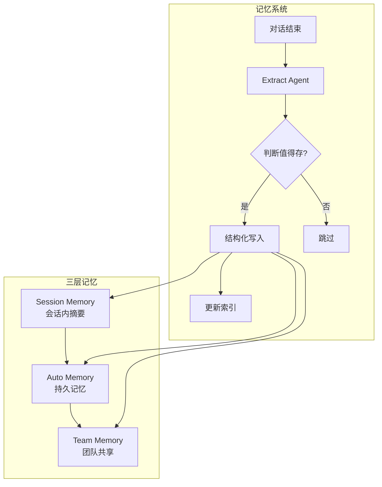

# Claude Code 记忆系统设计

> 基于 claude-source-leaked-main 源码分析
> 更新时间: 2026-04-29

> [!info] 核心价值
> 记忆系统不是简单的"记录全部对话"，而是**智能提取值得持久化的知识**

---

## 一、存储架构

### 1.1 长期记忆目录结构

**源码位置**：`src/memdir/paths.ts`

```
~/.claude/projects/<sanitized-git-root>/memory/
├── MEMORY.md              ← 索引文件（每次加载）
├── user_xxx.md           ← 用户记忆
├── feedback_xxx.md       ← 反馈记忆
├── project_xxx.md        ← 项目记忆
├── reference_xxx.md      ← 引用记忆
└── logs/
    └── YYYY/MM/
        └── YYYY-MM-DD.md  ← 每日日志
```

**路径解析优先级**：

```typescript
// src/memdir/paths.ts:223
export const getAutoMemPath = memoize((): string => {
  // 1. CLAUDE_COWORK_MEMORY_PATH_OVERRIDE env var (full-path override)
  const override = getAutoMemPathOverride() ?? getAutoMemPathSetting()
  if (override) {
    return override
  }
  // 2. settings.json autoMemoryDirectory (trusted sources)
  // 3. <memoryBase>/projects/<sanitized-git-root>/memory/
  const projectsDir = join(getMemoryBaseDir(), 'projects')
  return join(projectsDir, sanitizePath(getAutoMemBase()), 'memory')
})
```

| 优先级 | 来源 | 说明 |
|:-------|:-----|:-----|
| 1 | CLAUDE_COWORK_MEMORY_PATH_OVERRIDE | SDK/Cowork 显式设置 |
| 2 | settings.json | autoMemoryDirectory |
| 3 | 默认路径 | ~/.claude/projects/.../memory |

**启用控制**：

```typescript
// src/memdir/paths.ts:30
export function isAutoMemoryEnabled(): boolean {
  // CLAUDE_CODE_DISABLE_AUTO_MEMORY=1 → 关闭
  // CLAUDE_CODE_SIMPLE (--bare) → 关闭
  // CCR without REMOTE_MEMORY_DIR → 关闭
  // settings.json autoMemoryEnabled → 可关闭
}
```

### 1.2 Team 记忆目录结构

**源码位置**：`src/memdir/teamMemPaths.ts`

```
~/.claude/projects/<project>/memory/team/
├── MEMORY.md              ← Team 索引
└── *.md                 ← Team 共享记忆
```

**Team 路径**：

```typescript
// src/memdir/teamMemPaths.ts:84
export function getTeamMemPath(): string {
  return join(getAutoMemPath(), 'team')  // 子目录
}

// src/memdir/teamMemPaths.ts:73
export function isTeamMemoryEnabled(): boolean {
  // 需要 auto memory 开启
  // 并通过 GrowthBook feature gate: tengu_herring_clock
}
```

### 1.3 每日日志（可选模式）

**源码位置**：`src/memdir/paths.ts:246`

```typescript
// KAIROS 模式下使用每日日志而非 MEMORY.md
export function getAutoMemDailyLogPath(date: Date = new Date()): string {
  const yyyy = date.getFullYear().toString()
  const mm = (date.getMonth() + 1).toString().padStart(2, '0')
  const dd = date.getDate().toString().padStart(2, '0')
  return join(getAutoMemPath(), 'logs', yyyy, mm, `${yyyy}-${mm}-${dd}.md`)
}
```

### 1.4 路径安全验证

```typescript
// src/memdir/paths.ts:274
export function isAutoMemPath(absolutePath: string): boolean {
  const normalizedPath = normalize(absolutePath)
  return normalizedPath.startsWith(getAutoMemPath())
}

// src/memdir/teamMemPaths.ts:228 - Team 写入验证
export async function validateTeamMemWritePath(filePath: string): Promise<string> {
  // 1. 字符串级检查 (.. 遍历)
  // 2. 符号链接解析 + 真实路径检查
  // 防止: ../.. /etc/passwd 逃逸
}
```

---

## 二、记忆类型

### 2.1 四种记忆类型

**源码位置**：`src/memdir/memoryTypes.ts:14`

```typescript
export const MEMORY_TYPES = [
  'user',      // 用户角色、偏好、知识背景
  'feedback', // 用户的指��/纠正
  'project', // 项目状态、目标、截止日期
  'reference' // 外部系统指针
] as const
```

| 类型 | 用途 | Scope 规则 |
|:-----|:-----|:---------|
| `user` | 用户角色、偏好、知识背景 | 始终 private |
| `feedback` | 用户的指导/纠正 | 默认 private |
| `project` | 项目状态变化 | 强烈建议 team |
| `reference` | 外部系统引用 | 通常 team |

### 2.2 不保存的内容

**源码位置**：`src/memdir/memoryTypes.ts:183`

```typescript
export const WHAT_NOT_TO_SAVE_SECTION = [
  // 可从代码推导的信息
  '- Code patterns, conventions, architecture, file paths, or project structure — these can be derived by reading the current project state.',

  // git 是权威来源
  '- Git history, recent changes, or who-changed-what — `git log` / `git blame` are authoritative.',

  // 修复在代码中
  '- Debugging solutions or fix recipes — the fix is in the code; the commit message has the context.',

  // 已有文档
  '- Anything already documented in CLAUDE.md files.',

  // 临时状态
  '- Ephemeral task details: in-progress work, temporary state, current conversation context.',

  // 用户明确要求保存时也排除
  'These exclusions apply even when the user explicitly asks you to save.',
]
```

### 2.3 frontmatter 格式

```yaml
---
name: {{记忆名称（用于去重）}}
description: {{一句话描述（判断相关性）}}
type: {{user|feedback|project|reference}}
---

{{记忆内容}}
**Why:** {{原因说明}}
**How to apply:** {{应用场景}}
```

**字段作用**：

| 字段 | 作用 |
|:-----|:-----|
| `name` | 去重匹配、更新 |
| `description` | Relevance Selection 时判断相关性 |
| `type` | 分类、Scope 规则 |

---

## 三、加载机制

### 3.1 入口文件加载

**源码位置**：`src/memdir/paths.ts:257` + `src/memdir/memdir.ts:419`

```typescript
// 入口文件路径获取
export function getAutoMemEntrypoint(): string {
  return join(getAutoMemPath(), 'MEMORY.md')
}

// 加载入口文件内容
export async function loadMemoryPrompt(): Promise<string | null> {
  const autoEnabled = isAutoMemoryEnabled()
  // KAIROS 模式检查
  if (feature('KAIROS') && autoEnabled && getKairosActive()) {
    // 使用每日日志模式
  }
  // 加载并返回
}
```

**加载时截断保护**：

```typescript
// src/memdir/memdir.ts:50
export function truncateEntrypointContent(raw: string): EntrypointTruncation {
  // 行数限制 + 字节限制
  // 防止 MEMORY.md 过大
}
```

### 3.2 记忆检索

**源码位置**：`src/memdir/findRelevantMemories.ts`

```typescript
// 动态检索相关记忆（ Relevance Selection）
// 排除 MEMORY.md（已加载）
// 返回最多 5 个相关记忆
```

### 3.3 动态加载机制

**源码位置**：`src/memdir/memdir.ts:199`

```typescript
export function buildMemoryLines(...): string[] {
  // 构建 typed-memory 行为指令
}

export function buildMemoryPrompt(...): Promise<string> {
  // 构建带 MEMORY.md 内容的完整 prompt
}
```

---

## 四、提取机制

### 4.1 触发时机

**源码位置**：`src/services/extractMemories/extractMemories.ts:598`

```typescript
export async function executeExtractMemories(context): Promise<void> {
  // 对话结束时后台触发
  // 检查新消息数量
  // 跳过已写入的情况
}
```

### 4.2 子代理执行

**关键设计**：

```
1. 对话结束时后台触发，不阻塞主对话响应
2. 用子代理（Forked Agent）独立执行
3. 工具权限受限（只读 + 写 memory 目录）
4. 共享主对话的 prompt cache
5. 限制 maxTurns=5 防止 rabbit hole
```

**工具权限控制**：

```typescript
// 只允许：Read/Grep/Glob/Edit/Write(仅 memory 目录)
// 其他工具拒绝
```

### 4.3 提取 Prompt 设计

**源码位置**：`src/memdir/memoryTypes.ts` + `src/services/extractMemories/prompts.ts`

**Prompt 框架**：

```
1. 告诉它"用什么信��"
   - 只能基于对话内容提取，不能 grep/验证

2. 告诉它"哪些类型"
   - user/feedback/project/reference

3. 告诉它"什么不该存"
   - WHAT_NOT_TO_SAVE_SECTION

4. 告诉它"怎么存"
   - frontmatter 格式
   - 两步写入（写文件 + 写索引）

5. 现有记忆（做去重参考）
```

---

## 五、会话记忆

### 5.1 会话摘要触发条件

**源码位置**：`src/services/SessionMemory/sessionMemory.ts:134`

```typescript
export function shouldExtractMemory(messages: Message[]): boolean {
  // 1. 初始化阈值检查
  const currentTokenCount = tokenCountWithEstimation(messages)
  if (!isSessionMemoryInitialized()) {
    if (!hasMetInitializationThreshold(currentTokenCount)) {
      return false
    }
    markSessionMemoryInitialized()
  }

  // 2. Token 增量阈值检查
  const hasMetTokenThreshold = hasMetUpdateThreshold(currentTokenCount)

  // 3. 工具调用次数阈值检查
  const toolCallsSinceLastUpdate = countToolCallsSince(messages, lastMemoryMessageUuid)
  const hasMetToolCallThreshold = ...

  return hasMetTokenThreshold || hasMetToolCallThreshold
}
```

**触发条件**：

| 阶段 | 条件 | 说明 |
|:-----|:-----|:-----|
| 首次初始化 | Token 数 >= 阈值 | 首次需要达到初始化阈值 |
| 周期性检查 | Token 增量 >= 阈值 | 上次提取后新增 Token |
| 周期性检查 | 工具调用数 >= 阈值 | 上次提取后工具调用次数 |

### 5.2 会话压缩配置

**源码位置**：`src/services/compact/sessionMemoryCompact.ts:47`

```typescript
export type SessionMemoryCompactConfig = {
  minTokens: number        // 压缩后最小 tokens
  minTextBlockMessages: number  // 保留的最少消息数
  maxTokens: number       // 压缩后最大 tokens（硬限制）
}

export const DEFAULT_SM_COMPACT_CONFIG = {
  minTokens: 10_000,
  minTextBlockMessages: 5,
  maxTokens: 40_000,
}
```

### 5.3 会话记忆 vs 持久记忆

| 维度 | 会话记忆 (Session) | 持久记忆 (Long-term) |
|:-----|:------------------|:-------------------|
| 存储位置 | 内存/会话中 | ~/.claude/projects/.../memory |
| 生命周期 | 当前会话 | 永久 |
| 触发 | 自动压缩时 | 对话结束时 |
| 内容 | 摘要形式 | 结构化记忆文件 |

### 5.4 手动提取

**源码位置**：`src/services/SessionMemory/sessionMemory.ts:387`

```typescript
export async function manuallyExtractSessionMemory(...): Promise<ManualExtractionResult> {
  // 支持用户手动触发提取
}
```

---

## 六、TaskTree 迁移建议

### 推荐架构



### 核心设计原则

1. **不阻塞主对话** - 后台提取
2. **智能判断** - 用 LLM 而非规则
3. **增量提取** - 避免重复
4. **权限隔离** - 工具限制

---

*文档更新时间: 2026-04-29*
*基于 claude-source-leaked-main 源码分析*